# BAB V
# PEMODELAN DAN PERANCANGAN SISTEM

## 5.1 Pendahuluan

Bab ini membahas pemodelan dan perancangan Sistem Informasi Manajemen Aset Tanah (SIMASET) berdasarkan aplikasi yang telah dikembangkan. Pemodelan dilakukan untuk memberikan gambaran sistematis mengenai proses bisnis, kebutuhan sistem, interaksi pengguna dengan sistem, struktur data, serta rancangan antarmuka yang digunakan dalam aplikasi.

SIMASET dikembangkan sebagai sistem informasi berbasis web yang digunakan untuk mendukung pengelolaan aset tanah pemerintah daerah. Sistem ini mengintegrasikan data aset, data pertanahan, data spasial, pengelolaan sewa aset, notifikasi, riwayat aktivitas, serta mekanisme backup dalam satu platform. Dengan adanya sistem ini, proses pengelolaan aset tanah yang sebelumnya cenderung tersebar dan manual dapat dilakukan secara lebih terstruktur, terdokumentasi, dan berbasis data.

Pada bab ini, pembahasan difokuskan pada model proses bisnis, pendefinisian kebutuhan sistem, use case modeling, data flow diagram, activity diagram, class diagram, entity relationship diagram, struktur tabel database, sequence diagram, serta rancangan antarmuka. Seluruh bagian tersebut disusun berdasarkan kondisi aplikasi SIMASET saat ini, sehingga narasi yang dihasilkan tidak lagi bersifat proposal, tetapi menggambarkan sistem yang telah diimplementasikan.

Dalam implementasi aplikasi, terdapat beberapa peran utama, yaitu Admin BPKAD, Admin BPN, Petugas BPKAD, Petugas BPN, dan Masyarakat sebagai aktor eksternal. Pada sisi kode aplikasi, istilah role BPKAD direpresentasikan dengan kode `bpka` dan `admin_bpka`. Dalam penulisan akademik ini, istilah BPKAD digunakan untuk menjaga konsistensi dengan konteks instansi pengelola keuangan dan aset daerah.

## 5.2 Model Proses Bisnis

Model proses bisnis digunakan untuk menggambarkan perubahan alur kerja pengelolaan aset tanah sebelum dan sesudah diterapkannya SIMASET. Pemodelan ini penting untuk menunjukkan peran sistem dalam meningkatkan efisiensi, akurasi data, transparansi, serta kemudahan pengawasan terhadap aset tanah.

### 5.2.1 Kondisi Proses Bisnis Sebelum SIMASET

Sebelum diterapkannya SIMASET, proses pengelolaan aset tanah masih dilakukan melalui mekanisme yang belum terintegrasi secara optimal. Data aset tanah yang berkaitan dengan kepemilikan, status hukum, kondisi fisik, lokasi, serta pemanfaatan aset tersebar pada beberapa sumber data dan instansi. Kondisi tersebut menyebabkan proses pencocokan data antara BPN dan BPKAD membutuhkan waktu yang relatif lama.

Pada proses lama, petugas harus melakukan pemeriksaan data secara manual dari berbagai dokumen dan sumber informasi. Data tekstual aset sering kali tidak terhubung secara langsung dengan data spasial, sehingga analisis lokasi, status aset, dan potensi permasalahan tanah tidak dapat dilakukan secara cepat. Selain itu, pencatatan perubahan data dan aktivitas pengguna belum terdokumentasi secara sistematis, sehingga proses audit dan penelusuran perubahan data menjadi kurang efektif.

Dari sisi pelayanan, informasi mengenai aset yang dapat dimanfaatkan oleh masyarakat belum tersedia dalam satu media yang mudah diakses. Proses permintaan sewa aset masih memerlukan komunikasi langsung atau dokumen terpisah. Hal ini berpotensi menimbulkan keterlambatan dalam pengambilan keputusan, perbedaan interpretasi data, serta rendahnya transparansi informasi aset tanah.

### 5.2.2 Kondisi Proses Bisnis Setelah SIMASET

Setelah SIMASET diterapkan, proses pengelolaan aset tanah dilakukan melalui sistem yang terpusat dan berbasis web. Data aset dapat dikelola berdasarkan hak akses masing-masing pengguna. BPN berfokus pada pengelolaan data substansi pertanahan, seperti data legal, fisik, administratif, dan spasial. Sementara itu, BPKAD berfokus pada pengelolaan aset daerah, pusat data, penyewaan aset, serta pemrosesan permintaan sewa.

SIMASET menghubungkan data tekstual dan data spasial melalui peta interaktif. Pengguna dapat melihat sebaran aset, status aset, detail lokasi, serta layer peta yang relevan. Integrasi ini membantu proses analisis aset karena petugas tidak hanya melihat data dalam bentuk tabel, tetapi juga dapat memahami konteks lokasi aset secara visual.

Sistem juga menyediakan notifikasi, riwayat aktivitas, dan backup data. Riwayat aktivitas digunakan sebagai audit trail untuk mencatat aktivitas penting, seperti login, penambahan data, perubahan data, dan penghapusan data. Fitur backup digunakan untuk menjaga ketersediaan data dan meminimalkan risiko kehilangan data. Dengan demikian, SIMASET tidak hanya berfungsi sebagai media input data, tetapi juga sebagai alat pengendalian dan pengawasan aset tanah.

### 5.2.3 Identifikasi Perbaikan Proses Bisnis

Tabel 5.1 menunjukkan perbaikan proses bisnis yang dihasilkan melalui penerapan SIMASET.

**Tabel 5.1 Identifikasi Perbaikan Proses Bisnis**

| No | Kondisi Sebelum Sistem | Permasalahan | Perbaikan Melalui SIMASET |
| -- | ---------------------- | ------------ | ------------------------- |
| 1 | Data aset tersebar pada beberapa sumber | Terjadi inkonsistensi dan duplikasi data | Data aset dikelola melalui basis data terpusat sesuai hak akses |
| 2 | Verifikasi aset dilakukan secara manual | Proses verifikasi membutuhkan waktu lama | Data aset dapat diperiksa melalui dashboard, tabel, dan peta interaktif |
| 3 | Data tekstual tidak terhubung dengan data spasial | Analisis lokasi aset sulit dilakukan | Peta interaktif menampilkan marker, layer, dan detail aset |
| 4 | Aktivitas pengguna tidak tercatat secara memadai | Sulit melakukan audit perubahan data | Riwayat aktivitas mencatat aktivitas pengguna sebagai audit trail |
| 5 | Informasi sewa aset belum tersedia secara terbuka | Masyarakat sulit mengetahui aset yang tersedia | Halaman publik menampilkan aset yang tersedia untuk disewa |
| 6 | Permintaan sewa dilakukan melalui proses terpisah | Pemrosesan permintaan kurang terstruktur | Permintaan sewa dapat diajukan dan diproses melalui sistem |
| 7 | Backup data dilakukan secara manual | Risiko kehilangan data lebih tinggi | Admin dapat melakukan export, import, dan download backup data |
| 8 | Pengaturan hak akses belum terpusat | Fitur sensitif berisiko diakses pihak yang tidak berwenang | Sistem menerapkan autentikasi, MFA, dan role-based access control |

### 5.2.4 Diagram Proses Bisnis

Diagram proses bisnis pada bagian ini digunakan untuk menggambarkan alur kerja sebelum dan sesudah penerapan SIMASET. Gambar yang perlu disisipkan pada dokumen akhir adalah sebagai berikut:

**Gambar 5.1 Proses Bisnis Sebelum SIMASET**

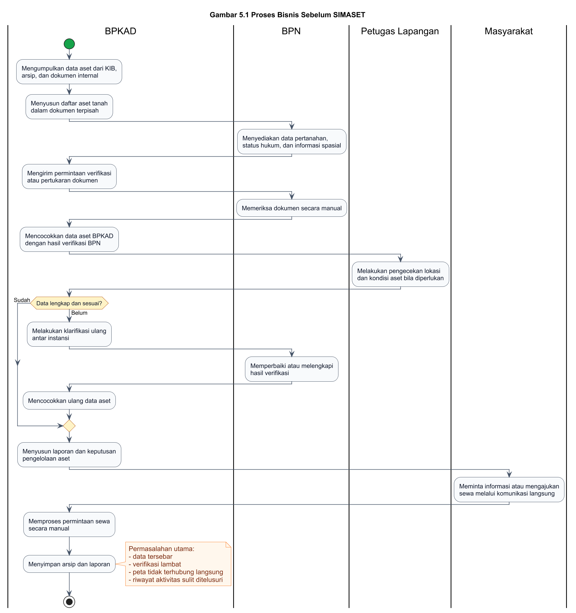

Gambar 5.1 menggambarkan proses pengelolaan aset tanah sebelum SIMASET diterapkan. Alur proses dimulai dari pengumpulan data aset, pemeriksaan dokumen, verifikasi instansi, pencocokan lokasi, hingga penyusunan laporan. Pada kondisi ini, proses masih bergantung pada pertukaran dokumen dan pengecekan manual.

**Gambar 5.2 Proses Bisnis Setelah SIMASET**

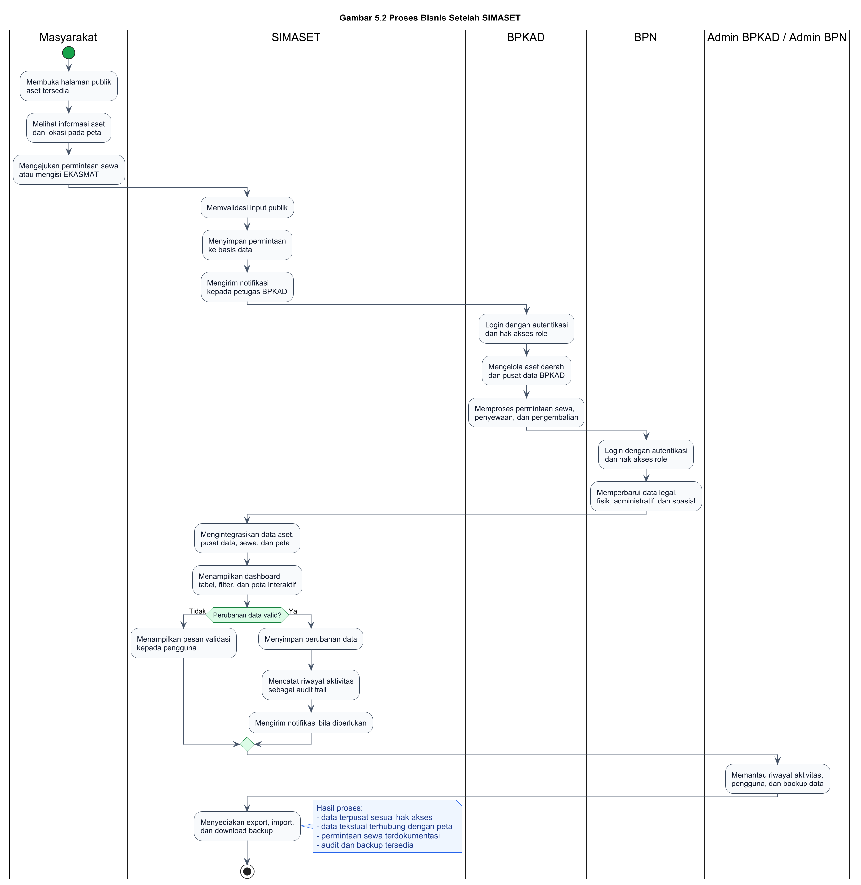

Gambar 5.2 menggambarkan proses pengelolaan aset tanah setelah SIMASET diterapkan. Data aset, pusat data, peta, sewa aset, notifikasi, riwayat, dan backup dikelola melalui sistem yang sama. Setiap pengguna mengakses fitur sesuai dengan peran dan hak akses yang telah ditentukan.

## 5.3 Pendefinisian Kebutuhan Sistem

Pendefinisian kebutuhan sistem dilakukan untuk menjelaskan fungsi yang harus disediakan oleh SIMASET serta karakteristik kualitas yang harus dipenuhi oleh sistem. Kebutuhan sistem dibagi menjadi kebutuhan fungsional dan kebutuhan non-fungsional.

### 5.3.1 Analisis Stakeholder

Stakeholder adalah pihak yang berinteraksi dengan sistem atau memiliki kepentingan terhadap penggunaan sistem. Tabel 5.2 menunjukkan stakeholder utama dalam SIMASET.

**Tabel 5.2 Analisis Stakeholder SIMASET**

| No | Stakeholder | Peran | Kebutuhan Utama |
| -- | ----------- | ----- | --------------- |
| 1 | Admin BPKAD | Pengelola administratif sistem pada sisi BPKAD | Mengelola data aset, pusat data, sewa aset, user, backup, riwayat, dan pengaturan |
| 2 | Admin BPN | Pengelola administratif sistem pada sisi BPN | Mengelola data substansi aset, user, backup, riwayat, dan peta |
| 3 | Petugas BPKAD | Pengelola data aset daerah dan sewa aset | Mengelola aset, pusat data, penyewaan, permintaan sewa, peta, notifikasi, dan profil |
| 4 | Petugas BPN | Pengelola data pertanahan | Melihat aset dan memperbarui data legal, fisik, administratif, serta spasial |
| 5 | Masyarakat | Aktor eksternal/publik | Melihat aset yang tersedia untuk disewa, mengajukan permintaan sewa, dan mengisi EKASMAT |

### 5.3.2 Kebutuhan Fungsional

Kebutuhan fungsional menjelaskan fungsi yang harus dapat dilakukan oleh sistem. Tabel 5.3 menunjukkan kebutuhan fungsional SIMASET.

**Tabel 5.3 Kebutuhan Fungsional SIMASET**

| Kode | Kebutuhan Fungsional | Deskripsi |
| ---- | -------------------- | --------- |
| FR-01 | Autentikasi pengguna | Sistem menyediakan login, logout, refresh token, pengelolaan profil, ganti password, dan MFA |
| FR-02 | Pengelolaan data aset | Sistem menyediakan fitur tambah, lihat, ubah, dan hapus data aset sesuai hak akses |
| FR-03 | Pengelolaan data legal | Sistem menyediakan pengelolaan data sertifikat, jenis hak, atas nama, dan status hukum |
| FR-04 | Pengelolaan data fisik | Sistem menyediakan pengelolaan lokasi, luas, batas tanah, penggunaan, kecamatan, dan kelurahan |
| FR-05 | Pengelolaan data administratif | Sistem menyediakan pengelolaan kode BMD, nilai aset, nilai buku, nilai NJOP, SK penetapan, dan OPD pengguna |
| FR-06 | Pengelolaan data spasial | Sistem menyediakan pengelolaan koordinat, polygon bidang tanah, dan data peta aset |
| FR-07 | Pengelolaan pusat data | Sistem menyediakan pengelolaan pusat data aset BPKAD serta akses baca untuk role internal |
| FR-08 | Peta interaktif | Sistem menampilkan peta aset, marker, layer, pencarian, filter, dan detail aset |
| FR-09 | Pengelolaan sewa aset | Sistem menyediakan pengelolaan data penyewaan, periode sewa, nilai sewa, kontrak, status, dan polygon sewa |
| FR-10 | Pengelolaan pengembalian aset | Sistem menyediakan pencatatan pengembalian aset beserta kondisi dan catatan pengembalian |
| FR-11 | Pengelolaan permintaan sewa | Sistem menerima permintaan sewa dari masyarakat dan menyediakan pemrosesan status oleh BPKAD |
| FR-12 | Notifikasi | Sistem menyediakan notifikasi in-app dan status baca notifikasi |
| FR-13 | Riwayat aktivitas | Sistem mencatat aktivitas pengguna sebagai audit trail |
| FR-14 | Backup data | Sistem menyediakan export, import, download, hapus backup, dan export CSV |
| FR-15 | Manajemen pengguna | Sistem menyediakan CRUD pengguna, reset password, dan aktivasi/nonaktivasi akun oleh admin |
| FR-16 | EKASMAT | Sistem menyediakan formulir evaluasi/kuesioner dan menyimpan skor responden |

### 5.3.3 Kebutuhan Non-Fungsional

Kebutuhan non-fungsional menjelaskan karakteristik kualitas sistem. Tabel 5.4 menunjukkan kebutuhan non-fungsional SIMASET.

**Tabel 5.4 Kebutuhan Non-Fungsional SIMASET**

| Aspek | Kebutuhan |
| ----- | --------- |
| Keamanan | Sistem menerapkan JWT, hashing password menggunakan bcrypt, MFA, role-based access control, dan pembatasan akses fitur berdasarkan role |
| Kinerja | Sistem mampu menampilkan halaman utama, data aset, dan peta interaktif dengan waktu respons yang layak pada koneksi internet standar |
| Keandalan | Sistem menyediakan backup data, error handling, dan pencatatan riwayat aktivitas untuk mendukung pemulihan serta audit |
| Ketergunaan | Sistem menyediakan antarmuka yang konsisten, navigasi berbasis role, pencarian, filter, dan tampilan responsif |
| Skalabilitas | Sistem menggunakan arsitektur frontend dan backend terpisah sehingga dapat dikembangkan untuk fitur tambahan |
| Maintainability | Sistem menggunakan struktur modular pada controller, route, model, service, component, page, store, dan utility |
| Kompatibilitas | Sistem dapat diakses melalui browser modern dan mendukung penggunaan pada desktop maupun perangkat mobile |

## 5.4 Functional Model

Functional model digunakan untuk menggambarkan fungsi-fungsi utama sistem dari sudut pandang pengguna. Pada bagian ini, functional model disajikan melalui use case modeling.

### 5.4.1 Pengertian Use Case

Use case merupakan pemodelan yang menggambarkan interaksi antara aktor dengan sistem untuk mencapai tujuan tertentu. Use case digunakan untuk menjelaskan layanan yang disediakan oleh sistem tanpa menjelaskan detail teknis implementasi internalnya.

Dalam konteks SIMASET, use case digunakan untuk memodelkan fungsi utama sistem, seperti login, pengelolaan data aset, pengelolaan pusat data, pengelolaan peta, pengelolaan sewa aset, permintaan sewa, notifikasi, riwayat aktivitas, backup data, manajemen pengguna, dan pengisian EKASMAT.

### 5.4.2 Simbol Use Case Diagram

Tabel 5.5 menunjukkan simbol yang digunakan dalam use case diagram.

**Tabel 5.5 Simbol Use Case Diagram**

| Simbol | Keterangan |
| ------ | ---------- |
| Actor | Menunjukkan peran pengguna atau sistem eksternal yang berinteraksi dengan sistem |
| Use Case | Menunjukkan fungsi atau layanan yang disediakan sistem |
| System Boundary | Menunjukkan batas ruang lingkup sistem |
| Association | Menunjukkan hubungan antara aktor dan use case |
| Include | Menunjukkan use case yang selalu dijalankan sebagai bagian dari use case lain |
| Extend | Menunjukkan use case tambahan yang dijalankan pada kondisi tertentu |

### 5.4.3 Aktor Sistem

Aktor dalam SIMASET terdiri dari aktor internal dan aktor eksternal. Aktor internal adalah pengguna yang memiliki akun dan masuk ke dalam dashboard aplikasi. Aktor eksternal adalah masyarakat yang menggunakan fitur publik.

**Tabel 5.6 Aktor Sistem SIMASET**

| No | Aktor | Deskripsi | Hak Akses Utama |
| -- | ----- | --------- | --------------- |
| 1 | Admin BPKAD | Pengguna dengan kewenangan administratif pada sisi BPKAD | Mengelola aset, pusat data, sewa, permintaan sewa, user, backup, riwayat, notifikasi, pengaturan, dan profil |
| 2 | Admin BPN | Pengguna dengan kewenangan administratif pada sisi BPN | Mengelola data aset BPN, data substansi, user, backup, riwayat, notifikasi, peta, pengaturan, dan profil |
| 3 | Petugas BPKAD | Pengguna operasional BPKAD | Mengelola aset, pusat data, sewa aset, permintaan sewa, peta, notifikasi, dan profil |
| 4 | Petugas BPN | Pengguna operasional BPN | Melihat aset dan memperbarui data legal, fisik, administratif, spasial, peta, notifikasi, dan profil |
| 5 | Masyarakat | Pengguna eksternal tanpa akses dashboard internal | Melihat aset sewa tersedia, mengajukan permintaan sewa, dan mengisi EKASMAT |

### 5.4.4 Use Case Diagram

Use case diagram SIMASET menggambarkan hubungan antara aktor dan fungsi utama sistem. Gambar 5.3 perlu disisipkan pada dokumen akhir.

**Gambar 5.3 Use Case Diagram SIMASET**

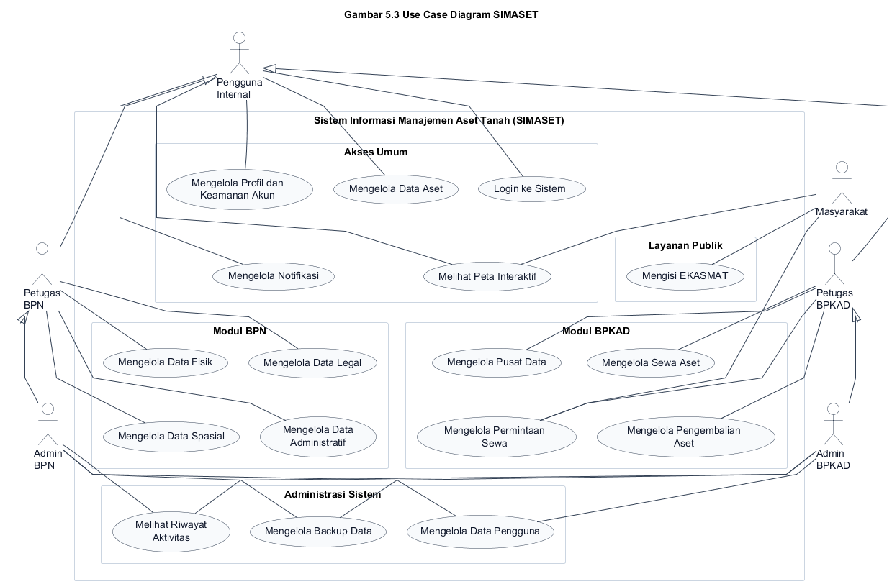

Keterangan Gambar 5.3:

Pada Gambar 5.3, aktor Pengguna Internal digunakan sebagai generalisasi untuk merangkum akses umum yang dimiliki oleh Admin BPKAD, Admin BPN, Petugas BPKAD, dan Petugas BPN.

1. Admin BPKAD memiliki akses paling luas pada modul BPKAD, termasuk aset, pusat data, sewa, permintaan sewa, user management, backup, riwayat, notifikasi, pengaturan, dan profil.
2. Admin BPN memiliki akses administratif pada modul BPN, terutama data substansi aset, peta, user management, backup, riwayat, notifikasi, pengaturan, dan profil.
3. Petugas BPKAD memiliki akses operasional terhadap aset, pusat data, sewa aset, permintaan sewa, peta, notifikasi, dan profil.
4. Petugas BPN memiliki akses untuk melihat data aset dan memperbarui data legal, fisik, administratif, serta spasial.
5. Masyarakat berinteraksi dengan fitur publik, yaitu melihat aset tersedia, mengajukan permintaan sewa, dan mengisi EKASMAT.

### 5.4.5 Deskripsi Use Case

Tabel 5.7 menunjukkan use case utama pada SIMASET.

**Tabel 5.7 Deskripsi Use Case SIMASET**

| ID | Use Case | Aktor | Tujuan |
| -- | -------- | ----- | ------ |
| UC-01 | Login ke Sistem | Admin BPKAD, Admin BPN, Petugas BPKAD, Petugas BPN | Mengautentikasi pengguna agar dapat mengakses dashboard sesuai role |
| UC-02 | Mengelola Profil dan Keamanan Akun | Semua user internal | Memperbarui profil, mengganti password, dan mengelola MFA |
| UC-03 | Mengelola Data Aset | Admin BPKAD, Admin BPN, Petugas BPKAD, Petugas BPN | Menambah, melihat, memperbarui, atau menghapus data aset sesuai hak akses |
| UC-04 | Mengelola Data Legal | Admin BPN, Petugas BPN | Mengelola data sertifikat, jenis hak, dan status hukum aset |
| UC-05 | Mengelola Data Fisik | Admin BPN, Petugas BPN | Mengelola lokasi, luas, batas tanah, dan penggunaan aset |
| UC-06 | Mengelola Data Administratif | Admin BPN, Petugas BPN | Mengelola data administratif dan keuangan aset |
| UC-07 | Mengelola Data Spasial | Admin BPN, Petugas BPN | Mengelola koordinat dan polygon bidang tanah |
| UC-08 | Mengelola Pusat Data | Admin BPKAD, Petugas BPKAD | Mengelola repositori data aset BPKAD |
| UC-09 | Melihat Peta Interaktif | Semua user internal, Masyarakat terbatas | Melihat lokasi aset, marker, layer, pencarian, dan detail aset |
| UC-10 | Mengelola Sewa Aset | Admin BPKAD, Petugas BPKAD | Mengelola data penyewaan aset tanah |
| UC-11 | Mengelola Permintaan Sewa | Admin BPKAD, Petugas BPKAD, Masyarakat | Mengajukan dan memproses permintaan sewa aset |
| UC-12 | Mengelola Pengembalian Aset | Admin BPKAD, Petugas BPKAD | Mencatat pengembalian aset setelah masa sewa selesai |
| UC-13 | Mengelola Notifikasi | Semua user internal | Melihat, membaca, dan menghapus notifikasi |
| UC-14 | Melihat Riwayat Aktivitas | Admin BPKAD, Admin BPN | Melihat audit trail aktivitas pengguna |
| UC-15 | Mengelola Backup Data | Admin BPKAD, Admin BPN | Melakukan export, import, download, hapus backup, dan export CSV |
| UC-16 | Mengelola Data Pengguna | Admin BPKAD, Admin BPN | Mengelola akun pengguna sistem |
| UC-17 | Mengisi EKASMAT | Masyarakat | Mengisi formulir evaluasi/kuesioner dan mengirim skor |

### 5.4.6 Matriks Hak Akses Use Case

Tabel 5.8 menunjukkan matriks hak akses setiap aktor terhadap fitur utama SIMASET.

**Tabel 5.8 Matriks Hak Akses SIMASET**

| Fitur | Admin BPKAD | Admin BPN | Petugas BPKAD | Petugas BPN | Masyarakat |
| ----- | ----------- | --------- | ------------- | ----------- | ---------- |
| Login | Ya | Ya | Ya | Ya | Tidak wajib |
| Dashboard | Ya | Ya | Ya | Ya | Tidak |
| Kelola Data Aset | CRUD | CRUD | CRUD | Update terbatas | Tidak |
| Data Legal | Tidak utama | CRUD | Tidak utama | Update | Tidak |
| Data Fisik | Tidak utama | CRUD | Tidak utama | Update | Tidak |
| Data Administratif | Tidak utama | CRUD | Tidak utama | Update | Tidak |
| Data Spasial | Tidak utama | CRUD | Tidak utama | Update | Tidak |
| Pusat Data | CRUD | Lihat | CRUD | Lihat | Tidak |
| Peta Interaktif | Ya | Ya | Ya | Ya | Terbatas |
| Sewa Aset | CRUD | Tidak | CRUD | Tidak | Lihat aset tersedia |
| Permintaan Sewa | Proses | Tidak | Proses | Tidak | Ajukan |
| Pengembalian Aset | Ya | Tidak | Ya | Tidak | Tidak |
| Notifikasi | Ya | Ya | Ya | Ya | Terbatas |
| Riwayat Aktivitas | Ya | Ya | Tidak | Tidak | Tidak |
| Backup Data | Ya | Ya | Tidak | Tidak | Tidak |
| Manajemen Pengguna | Ya | Ya | Tidak | Tidak | Tidak |
| Profil | Ya | Ya | Ya | Ya | Tidak |
| EKASMAT | Opsional | Opsional | Opsional | Opsional | Isi |

## 5.5 Data Flow Diagram (DFD)

Data Flow Diagram digunakan untuk menggambarkan bagaimana data mengalir dari entitas eksternal ke dalam proses utama SIMASET, kemudian disimpan atau diambil dari data store yang relevan. Walaupun DFD bukan bagian dari diagram UML, diagram ini digunakan sebagai pelengkap analisis agar aliran data antar proses, aktor, dan penyimpanan data dapat terlihat lebih jelas.

Pada SIMASET, DFD membantu memperlihatkan hubungan antara pengguna internal, masyarakat, proses bisnis utama, dan penyimpanan data yang mendukung operasi sistem. DFD disusun pada level 0 agar cakupan sistem dapat dilihat secara menyeluruh tanpa masuk terlalu jauh ke detail teknis endpoint atau operasi database.

**Gambar 5.4 Data Flow Diagram (DFD) Level 0 SIMASET**

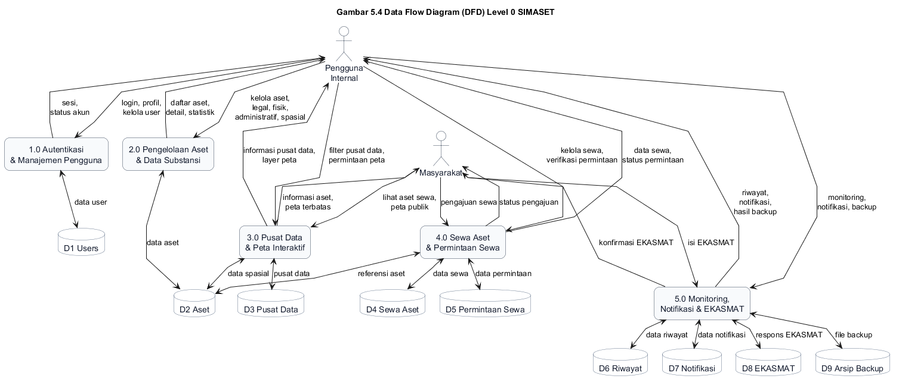

Gambar 5.4 menunjukkan bahwa aliran data pada SIMASET terbagi ke dalam lima proses utama. Proses autentikasi dan manajemen pengguna berhubungan langsung dengan data `users` untuk validasi akun, pengelolaan profil, status aktif, role, serta konfigurasi MFA. Proses pengelolaan aset dan data substansi memanfaatkan data store `aset` sebagai pusat informasi legal, fisik, administratif, spasial, status aset, dan sumber data.

Pada sisi layanan publik dan pemanfaatan aset, proses sewa aset dan permintaan sewa menggunakan data `aset`, `sewa_aset`, dan `permintaan_sewa` untuk menangani pengajuan masyarakat serta pemrosesan oleh BPKAD. Proses monitoring, notifikasi, dan EKASMAT memanfaatkan data `riwayat`, `notifikasi`, `ekasmat_responses`, serta arsip backup untuk mendukung audit trail, penyampaian informasi sistem, evaluasi layanan, dan pemulihan data.

Data store `pusat_data` digunakan sebagai repositori data aset BPKAD yang dapat menjadi referensi dalam pemeriksaan dan pengelolaan aset. Aliran data peta interaktif mengambil informasi dari `aset` dan `pusat_data` agar pengguna dapat melihat data tekstual serta data spasial dalam satu konteks. Dengan demikian, DFD SIMASET menegaskan bahwa sistem tidak hanya menerima input data, tetapi juga mengalirkan data tersebut ke modul analisis, pelayanan publik, monitoring, dan administrasi sistem.

## 5.6 Activity Diagram

Activity diagram digunakan untuk menggambarkan alur aktivitas dari awal hingga akhir pada proses utama sistem. Diagram ini membantu menjelaskan urutan aktivitas yang dilakukan oleh aktor dan respons sistem.

### 5.6.1 Activity Diagram Login dan MFA

**Gambar 5.5 Activity Diagram Login dan MFA**

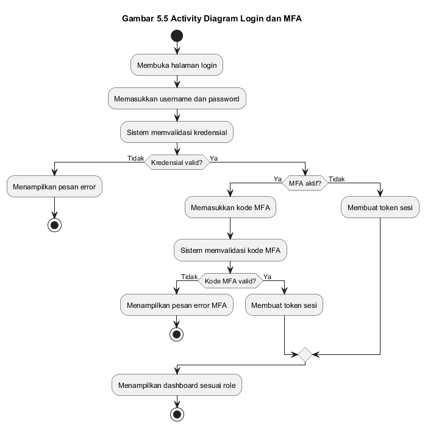

Alur login dimulai ketika pengguna membuka halaman login. Pengguna memasukkan username dan password, kemudian sistem memvalidasi kredensial. Apabila kredensial tidak valid, sistem menampilkan pesan kesalahan. Apabila kredensial valid dan akun memiliki MFA aktif, pengguna diminta memasukkan kode MFA. Setelah proses validasi berhasil, sistem membuat token sesi dan mengarahkan pengguna ke dashboard sesuai role.

### 5.6.2 Activity Diagram Mengelola Data Aset

**Gambar 5.6 Activity Diagram Mengelola Data Aset**

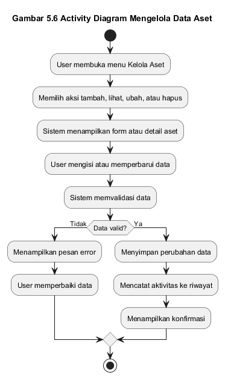

Alur pengelolaan data aset dimulai ketika pengguna membuka halaman kelola aset. Pengguna memilih aksi tambah, ubah, hapus, atau lihat detail data. Sistem menampilkan form atau detail sesuai aksi yang dipilih. Setelah pengguna mengisi data, sistem melakukan validasi. Jika data valid, sistem menyimpan perubahan dan mencatat aktivitas ke riwayat. Jika data tidak valid, sistem menampilkan pesan kesalahan agar pengguna dapat memperbaiki input.

### 5.6.3 Activity Diagram Mengelola Data Substansi BPN

**Gambar 5.7 Activity Diagram Mengelola Data Substansi BPN**

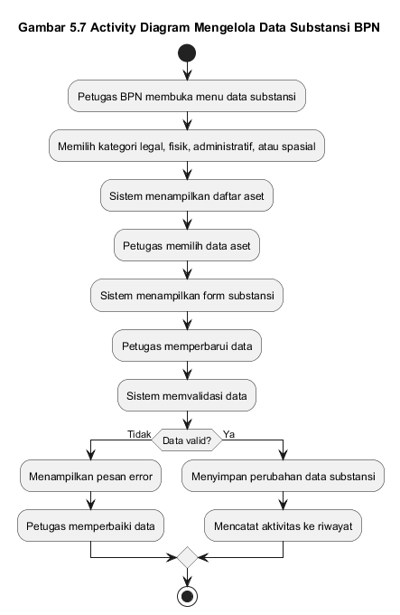

Pengelolaan data substansi dilakukan oleh Admin BPN dan Petugas BPN. Pengguna memilih menu data legal, data fisik, data administratif, atau data spasial. Sistem menampilkan daftar aset dan form perubahan data. Pengguna memperbarui data sesuai kategori, kemudian sistem memvalidasi dan menyimpan perubahan. Aktivitas perubahan data dicatat sebagai riwayat.

### 5.6.4 Activity Diagram Mengelola Pusat Data BPKAD

**Gambar 5.8 Activity Diagram Mengelola Pusat Data BPKAD**

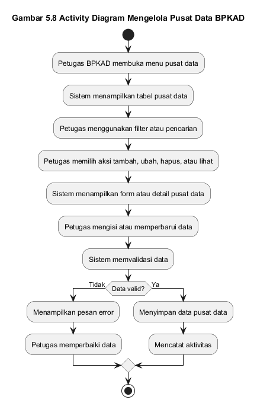

Pengguna BPKAD membuka menu pusat data. Sistem menampilkan daftar data pusat yang dapat difilter berdasarkan kecamatan, kelurahan, atau atribut aset lainnya. Pengguna dapat menambah, mengubah, atau menghapus data sesuai hak akses. Setelah data disimpan, sistem memperbarui daftar data dan mencatat aktivitas perubahan.

### 5.6.5 Activity Diagram Peta Interaktif

**Gambar 5.9 Activity Diagram Peta Interaktif**

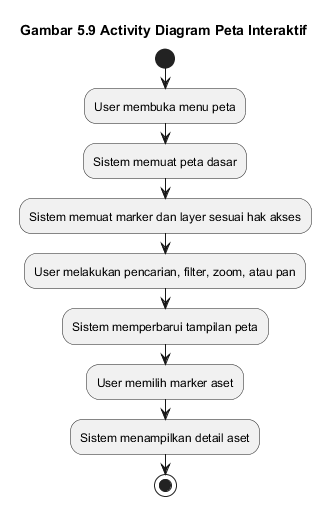

Alur peta interaktif dimulai ketika pengguna membuka menu peta. Sistem memuat peta dasar, marker aset, dan layer yang tersedia sesuai hak akses. Pengguna dapat melakukan zoom, pan, pencarian, filter, dan memilih marker. Ketika marker dipilih, sistem menampilkan detail aset. Pada role tertentu, pengguna juga dapat memperbarui data spasial atau melihat layer sesuai kebutuhan.

### 5.6.6 Activity Diagram Permintaan Sewa oleh Masyarakat

**Gambar 5.10 Activity Diagram Permintaan Sewa oleh Masyarakat**

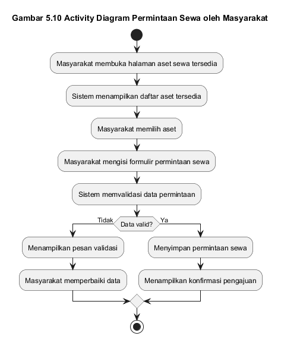

Masyarakat membuka halaman aset sewa tersedia. Sistem menampilkan daftar aset yang dapat disewa. Masyarakat memilih aset, mengisi data permohonan, dan mengirim permintaan sewa. Sistem memvalidasi data permohonan. Jika data valid, sistem menyimpan permintaan dengan status awal dan menampilkan konfirmasi. Permintaan tersebut kemudian dapat diproses oleh pihak BPKAD.

### 5.6.7 Activity Diagram Pengelolaan Sewa Aset

**Gambar 5.11 Activity Diagram Pengelolaan Sewa Aset**

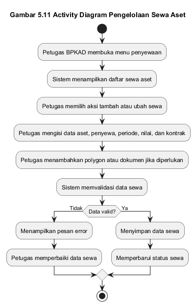

Pengelolaan sewa aset dilakukan oleh Admin BPKAD atau Petugas BPKAD. Pengguna membuka menu penyewaan, memilih aset, memasukkan data penyewa, periode sewa, nilai sewa, dokumen kontrak, dan polygon sewa jika diperlukan. Sistem memvalidasi data dan menyimpan informasi sewa. Status sewa dapat diperbarui menjadi tersedia, disewakan, akan berakhir, berakhir, dikembalikan, atau dibatalkan sesuai kondisi.

### 5.6.8 Activity Diagram Backup dan Restore Data

**Gambar 5.12 Activity Diagram Backup dan Restore Data**

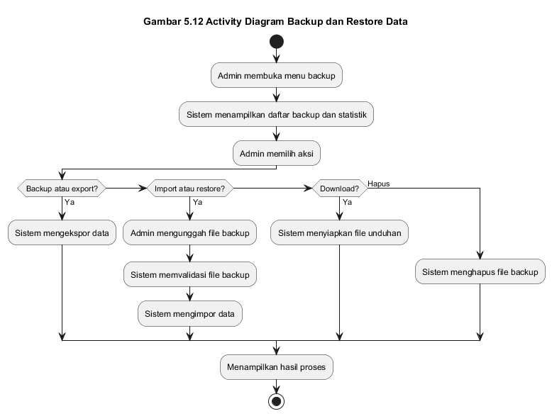

Admin membuka menu backup. Sistem menampilkan daftar backup dan statistik data. Admin dapat memilih export data, export CSV, upload file backup, import data, download backup, atau menghapus file backup. Setiap proses backup dan restore dilakukan melalui validasi sistem, kemudian hasil proses ditampilkan kepada admin.

## 5.7 Class Diagram

Class diagram digunakan untuk menggambarkan struktur kelas atau entitas utama yang digunakan dalam sistem. Dalam SIMASET, class diagram disusun berdasarkan model data yang digunakan pada backend aplikasi.

### 5.7.1 Deskripsi Class Utama

**Tabel 5.9 Class Utama SIMASET**

| No | Class | Deskripsi |
| -- | ----- | --------- |
| 1 | User | Menyimpan data akun pengguna, role, profil, status aktif, dan konfigurasi MFA |
| 2 | Aset | Menyimpan data aset tanah, data legal, fisik, administratif, spasial, dan status aset |
| 3 | PusatData | Menyimpan data pusat aset BPKAD sebagai referensi pengelolaan aset |
| 4 | SewaAset | Menyimpan data penyewaan aset, penyewa, nilai sewa, kontrak, status, dan pengembalian |
| 5 | PermintaanSewa | Menyimpan permintaan sewa dari masyarakat dan status pemrosesan oleh BPKAD |
| 6 | Riwayat | Menyimpan catatan aktivitas pengguna sebagai audit trail |
| 7 | Notifikasi | Menyimpan data notifikasi pengguna |
| 8 | EkasmatResponse | Menyimpan respons kuesioner EKASMAT |

### 5.7.2 Relasi Antar Class

Relasi antar class pada SIMASET adalah sebagai berikut:

1. User dapat membuat banyak Aset.
2. User dapat memiliki banyak Riwayat.
3. User dapat menerima banyak Notifikasi.
4. User dapat membuat banyak PusatData.
5. User dapat membuat banyak SewaAset.
6. Aset dapat menjadi referensi bagi banyak SewaAset.
7. SewaAset dapat menjadi referensi bagi banyak PermintaanSewa.

**Gambar 5.13 Class Diagram SIMASET**

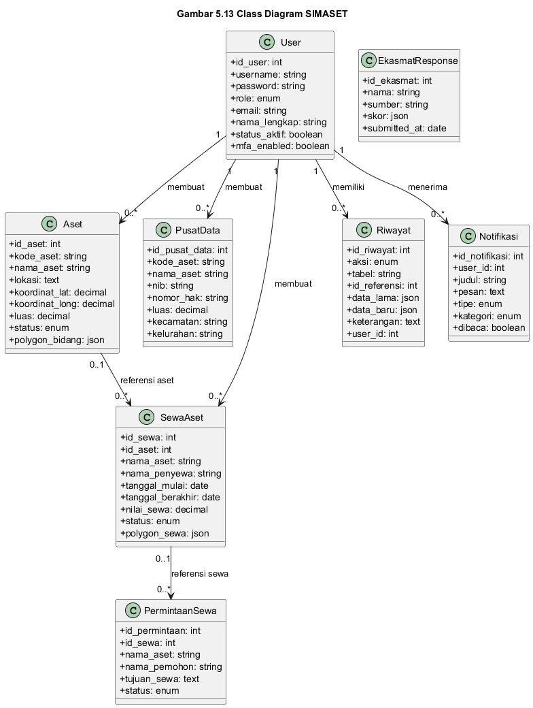

Gambar 5.13 menggambarkan hubungan antar class utama pada SIMASET. Relasi tersebut menunjukkan bahwa sistem tidak hanya menyimpan data aset, tetapi juga mencatat pengguna pembuat data, aktivitas pengguna, notifikasi, data sewa, dan permintaan sewa.

## 5.8 Entity Relationship Diagram (ERD)

Entity Relationship Diagram digunakan untuk menegaskan implementasi relasional dari model data SIMASET pada basis data PostgreSQL. ERD menampilkan primary key, foreign key, serta kardinalitas hubungan antar tabel utama yang digunakan sistem. Seperti DFD, ERD bukan diagram UML inti, tetapi digunakan sebagai pelengkap perancangan basis data agar struktur penyimpanan sistem dapat dijelaskan secara lebih tepat.

**Gambar 5.14 Entity Relationship Diagram (ERD) SIMASET**

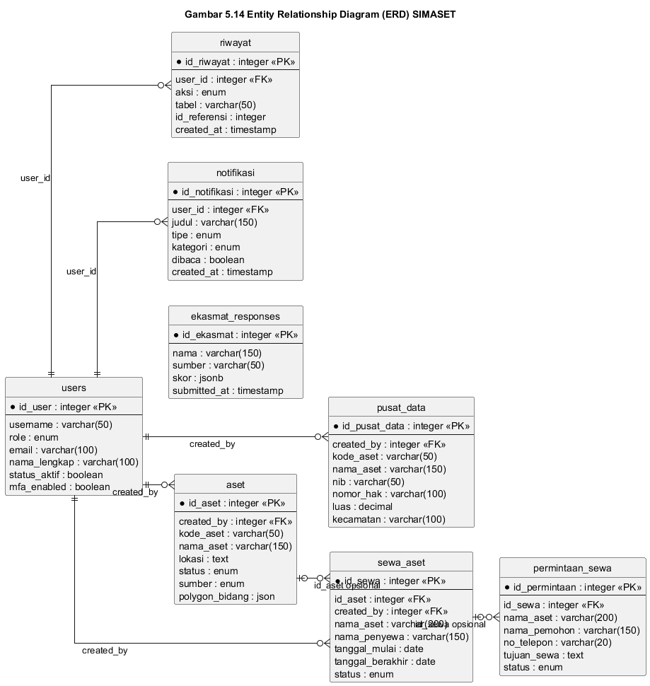

Gambar 5.14 menunjukkan bahwa tabel `users` menjadi entitas induk bagi beberapa tabel operasional, yaitu `aset`, `pusat_data`, `sewa_aset`, `riwayat`, dan `notifikasi`. Relasi ini sesuai dengan implementasi backend, yaitu data aset, pusat data, sewa aset, riwayat aktivitas, dan notifikasi menyimpan foreign key ke pengguna pembuat atau penerima data.

Tabel `aset` menjadi referensi bagi `sewa_aset`, karena satu aset dapat beberapa kali disewakan dalam periode berbeda. Pada implementasi model, foreign key `id_aset` pada `sewa_aset` bersifat opsional sehingga data sewa tetap dapat dicatat menggunakan identitas aset tekstual apabila belum terhubung langsung ke record aset. Tabel `sewa_aset` juga menjadi referensi bagi `permintaan_sewa`; foreign key `id_sewa` pada `permintaan_sewa` bersifat opsional karena permintaan publik dapat dicatat terlebih dahulu sebelum dikaitkan dengan data sewa tertentu. Tabel `ekasmat_responses` berdiri mandiri karena menyimpan respons publik tanpa ketergantungan langsung pada akun internal. Dengan susunan tersebut, ERD SIMASET telah sesuai dengan model Sequelize yang digunakan pada sistem saat ini.

## 5.9 Struktur Tabel Database

Struktur tabel database digunakan untuk menjelaskan implementasi penyimpanan data pada SIMASET. Sistem menggunakan PostgreSQL sebagai basis data dan Sequelize sebagai ORM.

### 5.9.1 Tabel Users

Tabel `users` digunakan untuk menyimpan data pengguna sistem.

**Tabel 5.10 Struktur Tabel Users**

| Field | Tipe Data | Keterangan |
| ----- | --------- | ---------- |
| id_user | Integer | Primary key pengguna |
| username | String | Username untuk login |
| password | String | Password yang telah di-hash |
| role | Enum | Role pengguna: admin_bpka, admin_bpn, bpka, bpn |
| email | String | Email pengguna |
| no_telepon | String | Nomor telepon pengguna |
| nip | String | Nomor induk pegawai |
| nik | String | Nomor induk kependudukan |
| nama_lengkap | String | Nama lengkap pengguna |
| jabatan | String | Jabatan pengguna |
| instansi | String | Instansi pengguna |
| alamat | Text | Alamat pengguna |
| status_aktif | Boolean | Status aktif akun |
| mfa_enabled | Boolean | Status aktivasi MFA |
| mfa_secret | String | Secret MFA |
| created_at | Date | Waktu pembuatan data |
| updated_at | Date | Waktu pembaruan data |

### 5.9.2 Tabel Aset

Tabel `aset` digunakan untuk menyimpan data utama aset tanah. Karena jumlah field pada tabel ini cukup banyak, struktur data dikelompokkan berdasarkan kategori.

**Tabel 5.11 Struktur Tabel Aset**

| Kelompok Data | Field Utama | Keterangan |
| ------------- | ----------- | ---------- |
| Identitas aset | id_aset, kode_aset, nama_aset, sumber | Identitas dasar aset dan sumber data |
| Lokasi dan luas | lokasi, koordinat_lat, koordinat_long, luas | Informasi lokasi dan ukuran aset |
| Status aset | status, jenis_masalah, jenis_aset | Status aktif, bermasalah, indikasi bermasalah, atau diblokir |
| Data legal | nomor_sertifikat, status_sertifikat, jenis_hak, atas_nama, tanggal_sertifikat, riwayat_perolehan, status_hukum | Informasi legal dan status hukum aset |
| Data fisik | kecamatan, desa_kelurahan, luas_lapangan, batas_utara, batas_selatan, batas_timur, batas_barat, penggunaan_saat_ini | Informasi kondisi fisik aset |
| Identifikasi spasial | nib, kw, polygon_bidang | Nomor bidang, kode wilayah, dan polygon GeoJSON |
| Data KIB/BPKAD | nibar, id_pemda, kode_barang, no_register, luas_kib, harga_perolehan, penggunaan_kib, file_sertifikat | Informasi aset dari data barang milik daerah |
| Data administratif | kode_bmd, nilai_buku, nilai_njop, sk_penetapan, opd_pengguna | Informasi administratif dan keuangan |
| Audit | created_by, created_at, updated_at | Informasi pembuat dan waktu perubahan data |

### 5.9.3 Tabel Pusat Data

Tabel `pusat_data` digunakan sebagai repositori data aset BPKAD.

**Tabel 5.12 Struktur Tabel Pusat Data**

| Field | Tipe Data | Keterangan |
| ----- | --------- | ---------- |
| id_pusat_data | Integer | Primary key pusat data |
| kode_aset | String | Kode aset |
| nama_aset | String | Nama aset |
| nib | String | Nomor Identifikasi Bidang |
| nomor_hak | String | Nomor hak atau nomor sertifikat |
| jenis_hak | String | Jenis hak |
| luas | Decimal | Luas aset |
| luas_lapangan | Decimal | Luas berdasarkan kondisi lapangan |
| penggunaan | String | Penggunaan aset |
| kecamatan | String | Kecamatan aset |
| kelurahan | String | Kelurahan aset |
| alamat | Text | Alamat aset |
| status_sertifikat | String | Status sertifikat |
| surat_ukur | String | Nomor surat ukur |
| pemilik_pertama | String | Pemilik pertama |
| pemilik_akhir | String | Pemilik akhir |
| atas_nama | String | Nama pemegang hak |
| produk | String | Produk sertifikat |
| kw | String | Kode wilayah |
| opd | String | Organisasi perangkat daerah |
| keterangan | Text | Keterangan tambahan |
| created_by | Integer | User pembuat data |
| created_at | Date | Waktu pembuatan data |
| updated_at | Date | Waktu pembaruan data |

### 5.9.4 Tabel Sewa Aset

Tabel `sewa_aset` digunakan untuk menyimpan data penyewaan aset.

**Tabel 5.13 Struktur Tabel Sewa Aset**

| Kelompok Data | Field Utama | Keterangan |
| ------------- | ----------- | ---------- |
| Identitas sewa | id_sewa, id_aset, nama_aset, lokasi_aset | Identitas penyewaan dan aset terkait |
| Data penyewa | nama_penyewa, nik_penyewa, instansi_penyewa, alamat_penyewa, telepon_penyewa, email_penyewa | Informasi penyewa |
| Periode sewa | tanggal_mulai, tanggal_berakhir | Tanggal awal dan akhir sewa |
| Nilai sewa | nilai_sewa, periode_bayar | Nilai dan periode pembayaran sewa |
| Kontrak | nomor_kontrak, file_kontrak, dokumen_pendukung | Dokumen dan nomor kontrak |
| Status sewa | status | Status tersedia, disewakan, akan berakhir, berakhir, dikembalikan, atau dibatalkan |
| Pengembalian | tanggal_pengembalian, kondisi_pengembalian, catatan_pengembalian, foto_kondisi | Informasi pengembalian aset |
| Spasial sewa | no_lot, foto_sewa, polygon_sewa | Informasi lot dan polygon sewa |
| Audit | created_by, created_at, updated_at | Informasi pembuat dan waktu perubahan data |

### 5.9.5 Tabel Permintaan Sewa

Tabel `permintaan_sewa` digunakan untuk menyimpan permintaan sewa dari masyarakat.

**Tabel 5.14 Struktur Tabel Permintaan Sewa**

| Field | Tipe Data | Keterangan |
| ----- | --------- | ---------- |
| id_permintaan | Integer | Primary key permintaan |
| id_sewa | Integer | Referensi data sewa |
| nama_aset | String | Nama aset yang diminta |
| nama_pemohon | String | Nama pemohon |
| nik | String | NIK pemohon |
| no_telepon | String | Nomor telepon pemohon |
| email | String | Email pemohon |
| alamat | Text | Alamat pemohon |
| tujuan_sewa | Text | Tujuan permohonan sewa |
| status | Enum | Status baru, diproses, disetujui, atau ditolak |
| catatan_admin | Text | Catatan dari admin |
| dokumen_respon | JSONB | Dokumen respons dari admin |
| created_at | Date | Waktu pembuatan data |
| updated_at | Date | Waktu pembaruan data |

### 5.9.6 Tabel Pendukung

Tabel pendukung terdiri dari `riwayat`, `notifikasi`, dan `ekasmat_responses`.

**Tabel 5.15 Struktur Tabel Pendukung**

| Tabel | Field Utama | Fungsi |
| ----- | ----------- | ------ |
| riwayat | id_riwayat, aksi, tabel, id_referensi, data_lama, data_baru, keterangan, ip_address, user_agent, user_id, created_at | Menyimpan catatan aktivitas pengguna |
| notifikasi | id_notifikasi, user_id, judul, pesan, tipe, kategori, referensi_id, referensi_tabel, dibaca, dibaca_at, created_at | Menyimpan notifikasi pengguna |
| ekasmat_responses | id_ekasmat, nama, sumber, skor, submitted_at | Menyimpan respons kuesioner EKASMAT |

## 5.10 Sequence Diagram

Sequence diagram digunakan untuk menggambarkan urutan interaksi antar objek berdasarkan waktu. Diagram ini memperlihatkan bagaimana aktor berinteraksi dengan halaman frontend, API backend, model database, dan layanan pendukung.

### 5.10.1 Sequence Diagram Login

**Gambar 5.15 Sequence Diagram Login**

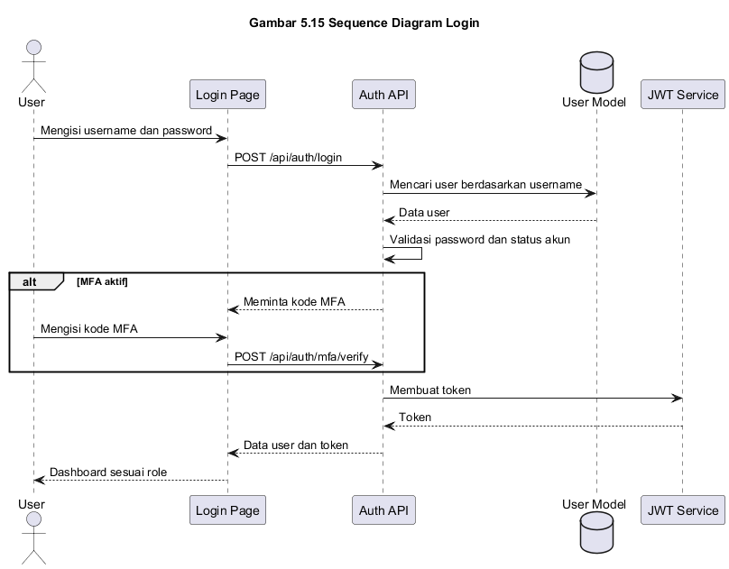

Pada proses login, pengguna memasukkan username dan password melalui halaman login. Frontend mengirimkan permintaan ke Auth API. Backend memeriksa data pengguna, membandingkan password yang telah di-hash, memeriksa status MFA jika aktif, membuat token JWT, lalu mengembalikan data sesi ke frontend. Setelah berhasil, pengguna diarahkan ke dashboard sesuai role.

### 5.10.2 Sequence Diagram Kelola Data Aset

**Gambar 5.16 Sequence Diagram Kelola Data Aset**

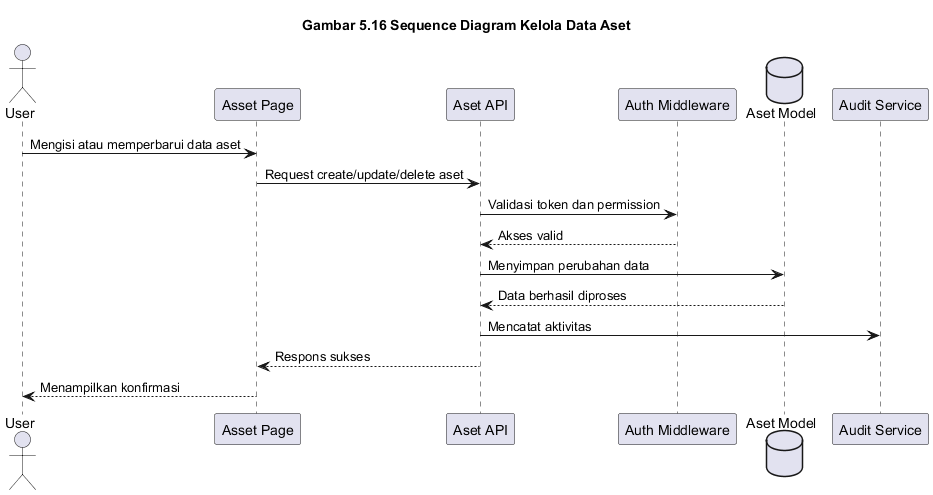

Pengguna membuka halaman aset dan memilih aksi tambah, ubah, hapus, atau lihat detail. Frontend mengirim permintaan ke Aset API. Backend memvalidasi token dan permission pengguna, kemudian menjalankan operasi pada model Aset. Setelah data berhasil diproses, sistem mencatat aktivitas pada riwayat dan mengembalikan respons ke frontend.

### 5.10.3 Sequence Diagram Peta Interaktif

**Gambar 5.17 Sequence Diagram Peta Interaktif**

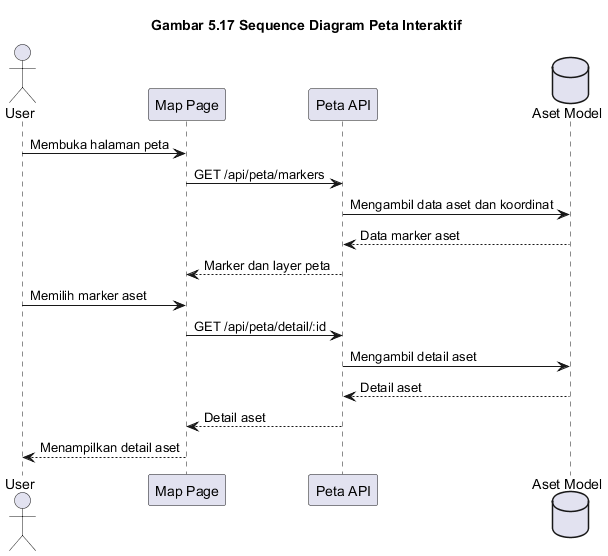

Pengguna membuka halaman peta. Frontend meminta data marker, layer, statistik, atau detail aset kepada Peta API. Backend mengambil data dari model Aset dan mengembalikan data spasial dalam format yang dapat ditampilkan oleh peta. Pengguna dapat melakukan pencarian, filter layer, serta melihat detail aset melalui panel atau popup.

### 5.10.4 Sequence Diagram Permintaan Sewa Publik

**Gambar 5.18 Sequence Diagram Permintaan Sewa Publik**

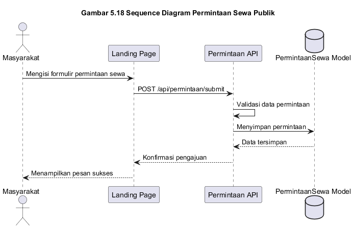

Masyarakat membuka halaman aset sewa tersedia, memilih aset, dan mengisi formulir permintaan. Frontend mengirim data permintaan ke Permintaan API. Backend memvalidasi data dan menyimpannya pada model PermintaanSewa. Setelah berhasil, sistem mengembalikan konfirmasi pengajuan dan data dapat diproses oleh BPKAD.

### 5.10.5 Sequence Diagram Pengelolaan Sewa Aset

**Gambar 5.19 Sequence Diagram Pengelolaan Sewa Aset**

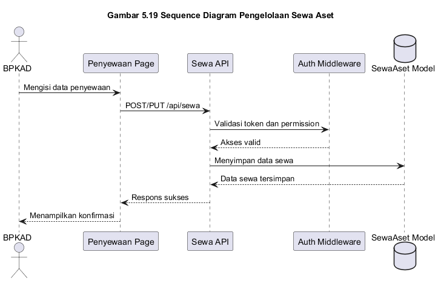

Petugas BPKAD membuka halaman penyewaan dan mengisi data sewa. Frontend mengirim permintaan ke Sewa API. Backend memvalidasi role pengguna, menyimpan data ke model SewaAset, dan mengembalikan respons. Jika terdapat perubahan status atau pengembalian, sistem memperbarui status sewa sesuai data yang dikirimkan.

### 5.10.6 Sequence Diagram Backup Data

**Gambar 5.20 Sequence Diagram Backup Data**

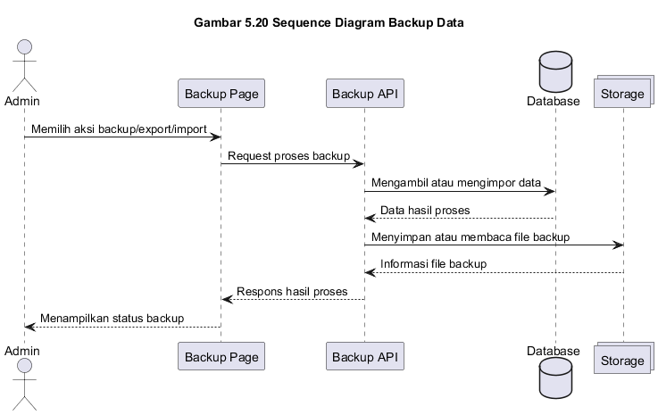

Admin membuka halaman backup dan memilih aksi export, import, download, atau hapus backup. Frontend mengirim permintaan ke Backup API. Backend memproses data database atau file backup sesuai aksi yang dipilih. Hasil proses dikembalikan ke frontend dalam bentuk pesan sukses, file download, atau pesan kesalahan jika proses gagal.

## 5.11 Perancangan Interface

Perancangan interface SIMASET dilakukan untuk memastikan setiap pengguna dapat mengakses fitur sesuai kebutuhan dan hak aksesnya. Karena aplikasi sudah dikembangkan, dokumentasi interface pada bab ini sebaiknya menggunakan screenshot aplikasi aktual, bukan wireframe lama.

### 5.11.1 Halaman Login

**Gambar 5.21 Tampilan Halaman Login**

Halaman login digunakan oleh pengguna internal untuk masuk ke sistem. Halaman ini menyediakan input username dan password, serta mendukung proses autentikasi lanjutan apabila MFA aktif pada akun pengguna.

### 5.11.2 Halaman Dashboard

**Gambar 5.22 Tampilan Halaman Dashboard**

Dashboard menampilkan ringkasan data dan statistik sesuai role pengguna. Informasi yang ditampilkan membantu pengguna memantau kondisi aset, status aset, dan data penting lainnya secara cepat.

### 5.11.3 Halaman Kelola Aset

**Gambar 5.23 Tampilan Halaman Kelola Aset**

Halaman kelola aset digunakan untuk melihat, menambah, memperbarui, dan menghapus data aset sesuai hak akses. Halaman ini menyediakan tabel data, pencarian, filter, dan aksi pengelolaan data.

### 5.11.4 Halaman Data Substansi

**Gambar 5.24 Tampilan Halaman Data Legal, Fisik, Administratif, dan Spasial**

Halaman data substansi digunakan oleh BPN untuk mengelola informasi legal, fisik, administratif, dan spasial aset. Pembagian halaman ini memudahkan pengguna dalam memperbarui data berdasarkan kategori informasi aset.

### 5.11.5 Halaman Pusat Data

**Gambar 5.25 Tampilan Halaman Pusat Data**

Halaman pusat data digunakan untuk mengelola repositori data aset BPKAD. Halaman ini menyediakan tabel data, filter kecamatan dan kelurahan, serta aksi tambah, ubah, dan hapus bagi pengguna yang memiliki hak akses.

### 5.11.6 Halaman Peta Interaktif

**Gambar 5.26 Tampilan Halaman Peta Interaktif**

Halaman peta interaktif menampilkan lokasi aset secara spasial. Pengguna dapat melihat marker aset, layer peta, filter status, pencarian, dan detail aset. Fitur ini membantu analisis berbasis lokasi dan mendukung pengambilan keputusan.

### 5.11.7 Halaman Penyewaan

**Gambar 5.27 Tampilan Halaman Penyewaan**

Halaman penyewaan digunakan oleh BPKAD untuk mengelola data sewa aset. Informasi yang dikelola meliputi data penyewa, periode sewa, nilai sewa, kontrak, status sewa, dan pengembalian aset.

### 5.11.8 Halaman Permintaan Sewa

**Gambar 5.28 Tampilan Halaman Permintaan Sewa**

Halaman permintaan sewa digunakan untuk memproses permintaan yang diajukan oleh masyarakat. Petugas BPKAD dapat melihat detail permintaan, memperbarui status, memberikan catatan, dan menghapus data permintaan jika diperlukan.

### 5.11.9 Halaman Publik Aset Sewa Tersedia

**Gambar 5.29 Tampilan Halaman Publik Aset Sewa Tersedia**

Halaman publik aset sewa tersedia digunakan oleh masyarakat untuk melihat aset yang dapat disewa. Melalui halaman ini, masyarakat dapat memperoleh informasi aset dan mengajukan permintaan sewa tanpa mengakses dashboard internal.

### 5.11.10 Halaman Riwayat, Notifikasi, Backup, Profil, dan Pengaturan

**Gambar 5.30 Tampilan Halaman Riwayat**

Halaman riwayat digunakan oleh admin untuk melihat catatan aktivitas pengguna. Data riwayat dapat digunakan sebagai audit trail.

**Gambar 5.31 Tampilan Halaman Notifikasi**

Halaman notifikasi digunakan untuk menampilkan daftar pemberitahuan sistem kepada pengguna.

**Gambar 5.32 Tampilan Halaman Backup**

Halaman backup digunakan oleh admin untuk melakukan export, import, download, dan penghapusan file backup.

**Gambar 5.33 Tampilan Halaman Profil dan Pengaturan**

Halaman profil dan pengaturan digunakan untuk mengelola informasi pengguna, keamanan akun, preferensi, serta konfigurasi sistem sesuai hak akses.

### 5.11.11 Halaman EKASMAT

**Gambar 5.34 Tampilan Halaman EKASMAT**

Halaman EKASMAT digunakan untuk mengisi kuesioner atau evaluasi layanan. Data yang dikirimkan disimpan dalam sistem dalam bentuk nama responden, sumber, skor, dan waktu pengisian.

## 5.12 Penutup

Berdasarkan pemodelan yang telah dilakukan, SIMASET memiliki struktur sistem yang terdiri dari proses bisnis terintegrasi, kebutuhan fungsional dan non-fungsional, aktor dengan hak akses berbeda, use case utama, data flow diagram, activity diagram, class diagram, entity relationship diagram, struktur tabel database, sequence diagram, dan rancangan antarmuka. Pemodelan ini menunjukkan bahwa SIMASET tidak hanya berfungsi sebagai sistem pencatatan aset tanah, tetapi juga sebagai platform pengelolaan aset yang menghubungkan data administratif, data pertanahan, data spasial, penyewaan aset, notifikasi, riwayat aktivitas, dan backup data.

Pembagian kewenangan dalam SIMASET menjadi aspek penting dalam rancangan sistem. BPN berfokus pada data substansi pertanahan, seperti data legal, fisik, administratif, dan spasial. BPKAD berfokus pada pengelolaan aset daerah, pusat data, penyewaan aset, permintaan sewa, dan pengembalian aset. Admin memiliki kewenangan tambahan untuk mengelola pengguna, riwayat, backup, dan pengaturan sistem. Masyarakat berperan sebagai aktor eksternal yang dapat melihat aset sewa tersedia, mengajukan permintaan sewa, dan mengisi EKASMAT.

Dengan adanya pemodelan ini, pengembangan dan evaluasi SIMASET dapat dilakukan secara lebih terarah. Diagram dan tabel yang disusun pada bab ini menjadi dasar untuk memahami alur kerja sistem, batasan hak akses, struktur data, serta hubungan antar komponen sistem. Selain itu, dokumentasi ini juga dapat digunakan sebagai acuan dalam pengujian, pemeliharaan, dan pengembangan fitur lanjutan pada SIMASET.

## Daftar Pustaka

Booch, G., Rumbaugh, J., & Jacobson, I. (2005). The Unified Modeling Language User Guide (2nd ed.). Addison-Wesley Professional.

Dennis, A., Wixom, B. H., & Roth, R. M. (2018). Systems Analysis and Design (7th ed.). John Wiley & Sons.

Fowler, M. (2004). UML Distilled: A Brief Guide to the Standard Object Modeling Language (3rd ed.). Addison-Wesley Professional.

Kendall, K. E., & Kendall, J. E. (2019). Systems Analysis and Design (10th ed.). Pearson Education.

Larman, C. (2004). Applying UML and Patterns: An Introduction to Object-Oriented Analysis and Design and Iterative Development (3rd ed.). Prentice Hall.

Object Management Group. (2017). Unified Modeling Language (UML) Specification Version 2.5.1. Retrieved from https://www.omg.org/spec/UML/

Pressman, R. S., & Maxim, B. R. (2020). Software Engineering: A Practitioner's Approach (9th ed.). McGraw-Hill Education.

Sommerville, I. (2016). Software Engineering (10th ed.). Pearson Education Limited.
