# BAB V
# ANALISIS KEBUTUHAN SISTEM INFORMASI MANAJEMEN ASET TANAH KOTA PASURUAN

## A. Pengelolaan Aset Tanah Konvensional

Aset tanah pemerintah daerah merupakan bagian dari barang milik daerah yang perlu dikelola secara tertib, aman, dan dapat dipertanggungjawabkan. Pengelolaan aset tanah tidak hanya berkaitan dengan pencatatan administratif, tetapi juga berkaitan dengan kepastian hukum, kesesuaian data fisik, data spasial, status pemanfaatan, serta riwayat perubahan data. Dalam praktik pengelolaan aset tanah secara konvensional, data aset sering tersebar pada beberapa dokumen, perangkat kerja, dan unit pengelola yang berbeda. Kondisi tersebut menyebabkan proses pencarian, pencocokan, dan pemutakhiran data membutuhkan waktu yang relatif lama.

Pada pengelolaan konvensional, data aset tanah milik pemerintah daerah umumnya tersimpan dalam bentuk daftar aset, dokumen sertifikat, dokumen pendukung, peta bidang, catatan pemanfaatan, dan arsip administrasi lain. Data dari Badan Pengelola Keuangan dan Aset Daerah (BPKAD) berfokus pada data barang milik daerah, sedangkan data dari Badan Pertanahan Nasional (BPN) berfokus pada data pertanahan seperti status hak, nomor bidang, data sertifikat, data fisik, serta data spasial. Perbedaan sumber data tersebut membutuhkan proses sinkronisasi agar data aset yang digunakan oleh pemerintah daerah dapat mencerminkan kondisi lapangan dan status pertanahan yang lebih akurat.

Kendala utama pada pengelolaan konvensional adalah belum terhubungnya data tekstual dengan data spasial secara langsung. Petugas dapat memiliki daftar aset dalam bentuk tabel, tetapi belum tentu dapat mengetahui lokasi aset, batas bidang, status bermasalah, atau potensi pemanfaatannya secara cepat. Proses verifikasi lokasi sering dilakukan dengan membuka dokumen peta secara terpisah, memeriksa koordinat, atau melakukan pengecekan manual. Dalam kondisi data yang banyak, proses tersebut dapat memperlambat pelayanan dan pengambilan keputusan.

Selain itu, pengelolaan aset tanah juga membutuhkan pencatatan riwayat aktivitas. Setiap penambahan, pembaruan, penghapusan, atau perubahan status aset seharusnya dapat ditelusuri kembali. Apabila aktivitas pengguna tidak terdokumentasi dengan baik, proses audit menjadi lebih sulit. Pengelolaan konvensional juga memiliki risiko duplikasi data, perbedaan versi data, kesalahan input, kehilangan dokumen pendukung, serta keterlambatan dalam penyusunan laporan.

Permasalahan lain muncul pada aspek pemanfaatan aset, khususnya aset tanah yang dapat disewakan atau dimanfaatkan oleh masyarakat. Informasi mengenai aset yang tersedia sering belum disajikan dalam satu media publik yang mudah diakses. Pengajuan permintaan sewa juga dapat berlangsung melalui komunikasi terpisah, sehingga status permintaan, catatan pemohon, dan tindak lanjut oleh petugas tidak terdokumentasi secara terpusat.

Berdasarkan kondisi tersebut, dibutuhkan sistem informasi yang mampu mengintegrasikan data aset, data pertanahan, data spasial, pusat data BPKAD, penyewaan aset, permintaan sewa, riwayat aktivitas, notifikasi, backup data, serta evaluasi layanan dalam satu platform. Sistem tersebut dikembangkan dalam bentuk Sistem Informasi Manajemen Aset Tanah (SIMASET) berbasis web.

## B. Tata Kelola Aset Tanah Terintegrasi

Tata kelola aset tanah terintegrasi merupakan proses pengelolaan data aset yang dilakukan secara sistematis melalui pengumpulan, penyimpanan, pemutakhiran, pengawasan, pemanfaatan, dan pengamanan data. Pada SIMASET, tata kelola aset tanah diarahkan untuk menghubungkan data administratif BPKAD dengan data pertanahan BPN serta data spasial yang ditampilkan melalui peta interaktif.

SIMASET membagi pengelolaan data berdasarkan peran pengguna. BPKAD berperan dalam pengelolaan aset daerah, pusat data, penyewaan aset, permintaan sewa, pengembalian aset, dan pemanfaatan aset. BPN berperan dalam pembaruan data substansi pertanahan yang meliputi data legal, data fisik, data administratif, dan data spasial. Admin memiliki kewenangan tambahan untuk mengelola pengguna, riwayat aktivitas, backup data, pengaturan sistem, dan keamanan akun.

Tata kelola terintegrasi pada SIMASET juga dilengkapi dengan peta interaktif. Peta berfungsi sebagai media untuk menampilkan lokasi aset, marker, polygon bidang tanah, layer wilayah, layer status aset, serta detail informasi aset. Dengan adanya peta, pengguna tidak hanya melihat data dalam bentuk tabel, tetapi juga dapat memahami posisi dan konteks spasial aset secara visual.

Gambar berikut menunjukkan perubahan proses bisnis sebelum dan sesudah penggunaan SIMASET.

**Gambar 5. Proses Bisnis Sebelum SIMASET**


Gambar 5 menunjukkan bahwa sebelum SIMASET diterapkan, data aset dan data pertanahan masih diperiksa melalui beberapa sumber secara terpisah. Proses verifikasi membutuhkan pengecekan dokumen, pencocokan lokasi, komunikasi antarinstansi, dan penyusunan laporan secara manual.

**Gambar 6. Proses Bisnis Setelah SIMASET**


Gambar 6 menunjukkan bahwa setelah SIMASET diterapkan, data aset, pusat data, peta, sewa aset, permintaan sewa, riwayat, notifikasi, dan backup dikelola dalam satu sistem. Setiap pengguna mengakses fitur sesuai hak akses yang ditentukan.

## C. Analisis Kebutuhan Pengguna

Analisis kebutuhan pengguna dilakukan untuk mengetahui kondisi pengelolaan aset saat ini, kendala yang dihadapi, dan kebutuhan yang diinginkan oleh pengguna. Kebutuhan pengguna pada SIMASET berasal dari peran utama dalam sistem, yaitu Admin BPKAD, Admin BPN, Petugas BPKAD, Petugas BPN, dan masyarakat sebagai pengguna eksternal.

**Tabel 6. Variabel Analisis Kebutuhan Pengguna SIMASET**

| No | Kategori | Variabel | Deskripsi |
| -- | -------- | -------- | --------- |
| 1 | Kebutuhan pengguna | Admin BPKAD | Mengelola data aset, pusat data, penyewaan aset, permintaan sewa, pengguna, backup, riwayat, notifikasi, dan pengaturan. |
| 2 | Kebutuhan pengguna | Admin BPN | Mengelola data substansi pertanahan, pengguna, backup, riwayat, notifikasi, peta, dan pengaturan. |
| 3 | Kebutuhan pengguna | Petugas BPKAD | Mengelola aset BPKAD, pusat data, penyewaan aset, pengembalian aset, permintaan sewa, peta, notifikasi, dan profil. |
| 4 | Kebutuhan pengguna | Petugas BPN | Melihat aset dan memperbarui data legal, fisik, administratif, serta spasial. |
| 5 | Kebutuhan pengguna | Masyarakat | Melihat aset tersedia, mengajukan permintaan sewa, dan mengisi evaluasi EKASMAT. |
| 6 | Desain sistem | Peta interaktif | Menampilkan marker, polygon, layer wilayah, layer status aset, pencarian, filter, dan detail aset. |
| 7 | Desain sistem | Keamanan data | Menerapkan login, JWT, hashing password, MFA, role-based access control, dan pembatasan menu berdasarkan role. |
| 8 | Desain sistem | Riwayat dan backup | Menyediakan audit trail aktivitas serta export, import, download, dan hapus backup. |
| 9 | Desain sistem | Evaluasi layanan | Menyediakan EKASMAT sebagai media pengumpulan penilaian pengguna terhadap aplikasi. |

Berdasarkan variabel tersebut, kebutuhan pengguna dirumuskan menjadi kebutuhan operasional yang harus disediakan oleh SIMASET. Kebutuhan tersebut tidak hanya berhubungan dengan fitur input data, tetapi juga dengan kemudahan pencarian data, kejelasan hak akses, keamanan data, dan pemantauan aktivitas.

**Tabel 7. Analisis Kebutuhan Pengguna SIMASET**

| No | Kondisi Saat Ini | Kendala/Permasalahan | Kebutuhan yang Diinginkan |
| -- | ---------------- | -------------------- | ------------------------- |
| 1 | Data aset berasal dari beberapa sumber data dan instansi. | Terjadi potensi perbedaan versi data antara data administratif dan data pertanahan. | Sistem menyediakan basis data terpusat yang dapat mengelola data aset sesuai role BPKAD dan BPN. |
| 2 | Data tekstual aset belum selalu terhubung dengan lokasi spasial. | Petugas kesulitan mengetahui posisi aset, status bidang, dan konteks wilayah secara cepat. | Sistem menyediakan peta interaktif, marker, polygon bidang, layer wilayah, dan detail aset. |
| 3 | Pembaruan data legal, fisik, administratif, dan spasial dilakukan oleh petugas yang berbeda. | Perlu pembagian kewenangan agar perubahan data dilakukan oleh pihak yang berwenang. | Sistem menyediakan role dan permission untuk Admin BPKAD, Admin BPN, Petugas BPKAD, dan Petugas BPN. |
| 4 | Aktivitas perubahan data belum selalu terdokumentasi secara terpusat. | Sulit menelusuri siapa yang melakukan perubahan dan kapan perubahan dilakukan. | Sistem mencatat aktivitas pengguna pada modul riwayat sebagai audit trail. |
| 5 | Informasi aset yang dapat disewa belum tersaji secara terbuka dan terstruktur. | Masyarakat sulit mengetahui aset yang tersedia serta prosedur pengajuan sewa. | Sistem menyediakan halaman publik aset tersedia dan formulir permintaan sewa. |
| 6 | Backup data dapat dilakukan secara manual dan tidak terpusat. | Risiko kehilangan data dan kesulitan pemulihan apabila terjadi gangguan sistem. | Sistem menyediakan fitur backup, import, export, download, hapus backup, dan export CSV. |
| 7 | Evaluasi kepuasan pengguna terhadap sistem belum terdokumentasi otomatis. | Pengembang sulit mengetahui persepsi pengguna terhadap kemudahan dan manfaat aplikasi. | Sistem menyediakan EKASMAT untuk mengumpulkan skor evaluasi pengguna. |

Berdasarkan analisis kebutuhan tersebut, SIMASET harus memenuhi beberapa spesifikasi utama sebagai berikut:

a. Sistem informasi dapat digunakan oleh pengguna internal berdasarkan akun dan role.  
b. Sistem menyediakan pengelolaan data aset tanah yang terdiri dari data umum, legal, fisik, administratif, dan spasial.  
c. Sistem menyediakan pusat data BPKAD sebagai repositori data aset daerah.  
d. Sistem menyediakan peta interaktif yang menampilkan aset secara spasial.  
e. Sistem menyediakan fitur penyewaan aset, permintaan sewa publik, dan pengembalian aset.  
f. Sistem mencatat riwayat aktivitas pengguna sebagai audit trail.  
g. Sistem menyediakan notifikasi untuk menyampaikan informasi kepada pengguna.  
h. Sistem menyediakan backup dan restore data untuk menjaga ketersediaan data.  
i. Sistem menyediakan pengaturan profil, keamanan akun, dan MFA.  
j. Sistem menyediakan EKASMAT sebagai media evaluasi kinerja aplikasi.

Kebutuhan pengguna tersebut menjadi dasar dalam perancangan sistem informasi pada BAB VI. Perancangan dilakukan melalui pemodelan UML, struktur basis data, pengkodean program, rancangan interface, pengujian sistem, dan evaluasi pengguna.

# BAB VI
# PERANCANGAN DESAIN SISTEM INFORMASI MANAJEMEN ASET TANAH KOTA PASURUAN

## A. Desain Sistem Informasi

Desain sistem informasi merupakan tahap perancangan struktur, komponen, basis data, antarmuka, dan alur kerja sistem agar sesuai dengan kebutuhan pengguna. SIMASET dirancang sebagai aplikasi web full-stack yang terdiri dari frontend React dan backend Express. Frontend digunakan sebagai antarmuka pengguna, sedangkan backend digunakan sebagai penyedia API, pengelola autentikasi, pengatur hak akses, dan penghubung dengan database PostgreSQL melalui Sequelize.

Perancangan SIMASET dilakukan dengan beberapa komponen utama, yaitu Unified Modeling Language (UML), pengkodean program, interface, serta pengujian sistem dan evaluasi pengguna. Urutan pembahasan pada bab ini mengikuti format perancangan sistem informasi, yaitu dimulai dari model sistem, struktur kode, rancangan tampilan, dan pengujian.

### 1. Unified Modeling Language (UML)

Unified Modeling Language (UML) digunakan untuk menggambarkan sistem secara visual agar alur kerja, aktor, fungsi, struktur data, dan hubungan antar komponen dapat dipahami dengan lebih jelas. Pada SIMASET, UML digunakan dalam bentuk use case diagram, activity diagram, class diagram, dan didukung dengan ERD serta DFD untuk menjelaskan hubungan data.

#### a. Use Case Diagram

Use case diagram menggambarkan hubungan antara aktor dan fungsi yang tersedia pada SIMASET. Aktor utama pada sistem terdiri dari Admin BPKAD, Admin BPN, Petugas BPKAD, Petugas BPN, dan masyarakat sebagai aktor eksternal.

**Gambar 7. Use Case Diagram SIMASET**


Gambar 7 menunjukkan bahwa pengguna internal dapat mengakses dashboard, aset, pusat data, peta, notifikasi, dan profil sesuai dengan role masing-masing. Admin memiliki kewenangan tambahan pada manajemen pengguna, backup, riwayat, dan pengaturan. BPKAD memiliki kewenangan utama pada aset daerah, pusat data, penyewaan aset, dan permintaan sewa. BPN memiliki kewenangan utama pada pembaruan data substansi pertanahan. Masyarakat memiliki akses publik untuk melihat aset yang tersedia, mengajukan permintaan sewa, dan mengisi EKASMAT.

#### b. Diagram Activity

Activity diagram menggambarkan urutan aktivitas pengguna dan sistem dalam menjalankan proses tertentu. Pada SIMASET, activity diagram dibuat untuk proses login, kelola aset, data substansi BPN, pusat data BPKAD, peta interaktif, permintaan sewa, pengelolaan sewa, dan backup data.

**Gambar 8. Diagram Activity Login dan MFA**


Gambar 8 menjelaskan proses pengguna melakukan login. Pengguna memasukkan username dan password. Sistem memvalidasi data pengguna, memeriksa status aktif, memverifikasi password, dan memeriksa kebutuhan OTP atau MFA. Jika proses autentikasi berhasil, sistem membuat token sesi dan mengarahkan pengguna ke dashboard.

**Gambar 9. Diagram Activity Mengelola Data Aset**


Gambar 9 menggambarkan proses pengelolaan data aset. Pengguna membuka halaman aset, sistem menampilkan daftar aset, kemudian pengguna dapat menambah, melihat, mengubah, atau menghapus data sesuai hak akses. Setelah data diproses, sistem menyimpan perubahan dan mencatat aktivitas pada riwayat.

**Gambar 10. Diagram Activity Mengelola Data Substansi BPN**


Gambar 10 menjelaskan alur pembaruan data legal, fisik, administratif, dan spasial oleh BPN. Petugas memilih kategori substansi, memperbarui data yang diperlukan, kemudian sistem memvalidasi input dan menyimpan pembaruan pada database aset.

**Gambar 11. Diagram Activity Mengelola Pusat Data BPKAD**


Gambar 11 menunjukkan bahwa pusat data digunakan sebagai repositori data aset BPKAD. Pengguna BPKAD dapat menambah, mengubah, menghapus, mencari, dan memfilter data pusat. Role BPN dapat melihat data pusat sebagai referensi.

**Gambar 12. Diagram Activity Peta Interaktif**


Gambar 12 menjelaskan proses pengguna membuka peta, memilih layer, melakukan pencarian atau filter, dan melihat detail aset. Sistem mengambil data aset dan data spasial dari backend, kemudian menampilkannya pada peta.

**Gambar 13. Diagram Activity Permintaan Sewa oleh Masyarakat**


Gambar 13 menunjukkan proses masyarakat membuka halaman publik, memilih aset yang tersedia, mengisi formulir permintaan sewa, dan mengirimkan pengajuan. Sistem memvalidasi data pemohon dan menyimpan permintaan dengan status awal.

**Gambar 14. Diagram Activity Pengelolaan Sewa Aset**


Gambar 14 menggambarkan proses BPKAD mengelola sewa aset, mulai dari pemilihan aset, pengisian data penyewa, penentuan periode, nilai sewa, dokumen kontrak, status sewa, hingga pengembalian aset.

**Gambar 15. Diagram Activity Backup dan Restore Data**


Gambar 15 menjelaskan proses admin melakukan export, import, download, dan hapus backup. Proses ini digunakan untuk menjaga ketersediaan data dan mendukung pemulihan data apabila terjadi gangguan.

#### c. Class Diagram

Class diagram digunakan untuk menggambarkan struktur class utama pada SIMASET dan hubungan antar class. Class utama yang digunakan meliputi User, Aset, PusatData, SewaAset, PermintaanSewa, Riwayat, Notifikasi, dan EkasmatResponse.

**Gambar 16. Class Diagram SIMASET**


Gambar 16 menunjukkan bahwa User berhubungan dengan aset, pusat data, riwayat, notifikasi, dan sewa aset. Aset memiliki relasi dengan SewaAset, sedangkan SewaAset memiliki relasi dengan PermintaanSewa. EkasmatResponse berdiri sebagai data evaluasi publik yang tidak wajib terhubung dengan akun internal.

#### d. Data Flow Diagram dan Entity Relationship Diagram

Selain UML, SIMASET juga dilengkapi dengan Data Flow Diagram (DFD) dan Entity Relationship Diagram (ERD). DFD digunakan untuk menggambarkan aliran data antar proses, sedangkan ERD digunakan untuk menggambarkan struktur relasi database.

**Gambar 17. Data Flow Diagram Level 0 SIMASET**


DFD menunjukkan aliran data dari pengguna internal dan masyarakat menuju proses autentikasi, pengelolaan aset, peta, sewa aset, permintaan sewa, riwayat, notifikasi, backup, dan EKASMAT. Data yang diproses disimpan pada tabel users, aset, pusat_data, sewa_aset, permintaan_sewa, riwayat, notifikasi, dan ekasmat_responses.

**Gambar 18. Entity Relationship Diagram SIMASET**


ERD menunjukkan hubungan antar tabel utama. Tabel users menjadi referensi bagi aset, pusat_data, sewa_aset, riwayat, dan notifikasi. Tabel aset menjadi referensi bagi sewa_aset, sedangkan sewa_aset menjadi referensi bagi permintaan_sewa.

### 2. Pengkodean Program

Pengkodean program SIMASET dilakukan dengan arsitektur frontend dan backend yang terpisah. Frontend dikembangkan menggunakan React, Vite, Tailwind CSS, Zustand, React Router, Leaflet, MapLibre, dan Recharts. Backend dikembangkan menggunakan Node.js, Express, Sequelize, PostgreSQL, JWT, bcrypt, nodemailer, multer, dan service pendukung lainnya.

#### a. Struktur Folder Pengkodean

Struktur folder pengkodean SIMASET disusun secara modular agar setiap komponen mudah dipelihara. Struktur utama proyek adalah sebagai berikut.

**Gambar 19. Struktur Folder Pengkodean SIMASET**

```text
Simaset/
|-- backend/
|   |-- src/
|   |   |-- config/          Konfigurasi database
|   |   |-- controllers/     Logika request dan response API
|   |   |-- database/        Migration dan seeder
|   |   |-- middleware/      Auth, role, dan permission middleware
|   |   |-- models/          Model Sequelize
|   |   |-- routes/          Definisi endpoint API
|   |   |-- services/        Audit, notifikasi, OTP, dan storage
|   |   |-- utils/           Utility backend
|   |   `-- server.js        Entry point backend
|   |-- package.json
|
|-- frontend/
|   |-- src/
|   |   |-- assets/          Asset gambar dan webgis
|   |   |-- components/      Komponen UI dan modul
|   |   |-- data/            Data pendukung EKASMAT
|   |   |-- hooks/           Custom hooks
|   |   |-- layouts/         Header, sidebar, root layout
|   |   |-- pages/           Halaman aplikasi
|   |   |-- router/          Konfigurasi route dan guard
|   |   |-- services/        Service API frontend
|   |   |-- stores/          Zustand store
|   |   `-- utils/           Permission dan utility
|   |-- package.json
|
`-- documents/
    `-- bab5/
        |-- gambar/          Diagram UML, DFD, ERD, sequence
        |-- plantuml/        Sumber PlantUML
        |-- drawio/          Sumber drawio
        `-- wireframe/       Wireframe interface
```

Struktur tersebut menunjukkan bahwa SIMASET dirancang dengan pemisahan tanggung jawab. Backend bertanggung jawab terhadap API, keamanan, dan database, sedangkan frontend bertanggung jawab terhadap tampilan, navigasi, interaksi pengguna, dan konsumsi API.

#### b. Back End

Backend SIMASET menggunakan Express.js sebagai framework API dan Sequelize sebagai Object Relational Mapping (ORM) untuk menghubungkan aplikasi dengan PostgreSQL. Backend memiliki beberapa modul utama, yaitu autentikasi, aset, pusat data, peta, sewa aset, permintaan sewa, notifikasi, riwayat, backup, user management, upload, dan EKASMAT.

Autentikasi dilakukan menggunakan JSON Web Token (JWT). Password pengguna disimpan dalam bentuk hash menggunakan bcrypt. Sistem juga menyediakan MFA untuk meningkatkan keamanan akun. Middleware digunakan untuk memvalidasi token, role, dan permission sebelum pengguna dapat mengakses endpoint tertentu.

Contoh endpoint utama pada backend adalah sebagai berikut:

| Modul | Endpoint Utama | Fungsi |
| ----- | -------------- | ------ |
| Auth | `/api/auth/login`, `/api/auth/me`, `/api/auth/profile` | Login, validasi pengguna, profil, MFA, refresh token |
| Aset | `/api/aset` | CRUD data aset dan sinkronisasi data aset |
| Pusat Data | `/api/pusat-data` | Mengelola pusat data aset BPKAD |
| Peta | `/api/peta` | Menyediakan data marker, layer, statistik, dan detail peta |
| Sewa | `/api/sewa` | Mengelola penyewaan, pengembalian, statistik, dan aset tersedia |
| Permintaan | `/api/permintaan` | Mengelola permintaan sewa masyarakat |
| Backup | `/api/backup` | Export, import, download, hapus backup, dan export CSV |
| EKASMAT | `/api/ekasmat` | Menyimpan dan menampilkan respons evaluasi aplikasi |

#### c. Front End

Frontend SIMASET menggunakan React dengan Vite. Antarmuka dibuat modular berdasarkan halaman dan komponen. Route aplikasi dikelola dengan React Router, sedangkan state pengguna dan sesi dikelola menggunakan Zustand. Untuk peta, aplikasi menggunakan Leaflet, React-Leaflet, dan MapLibre. Untuk grafik dan visualisasi statistik, aplikasi menggunakan Recharts.

Frontend memiliki dua kelompok tampilan, yaitu tampilan internal dan tampilan publik. Tampilan internal menggunakan RootLayout yang berisi header, sidebar, dan area konten. Tampilan publik digunakan untuk login, aset sewa tersedia, dan EKASMAT.

#### d. Basis Data

Basis data SIMASET menggunakan PostgreSQL. Struktur tabel utama disusun berdasarkan model Sequelize. Tabel inti yang digunakan dapat dilihat pada Tabel 8.

**Tabel 8. Basis Data SIMASET**

| No | Bagian Data | Field Utama | Jenis Data/Keterangan |
| -- | ----------- | ----------- | --------------------- |
| 1 | users | id_user | Integer, primary key |
| 2 | users | username, password, role | Akun pengguna, password hash, role pengguna |
| 3 | users | email, no_telepon, nip, nik, nama_lengkap | Identitas dan kontak pengguna |
| 4 | users | status_aktif, mfa_enabled, mfa_secret | Status akun dan konfigurasi MFA |
| 5 | aset | id_aset, kode_aset, nama_aset, lokasi | Identitas aset tanah |
| 6 | aset | koordinat_lat, koordinat_long, polygon_bidang | Data spasial aset |
| 7 | aset | nomor_sertifikat, jenis_hak, atas_nama, status_hukum | Data legal aset |
| 8 | aset | kecamatan, desa_kelurahan, luas, luas_lapangan, batas_utara, batas_selatan, batas_timur, batas_barat | Data fisik aset |
| 9 | aset | kode_bmd, nilai_buku, nilai_njop, sk_penetapan, opd_pengguna | Data administratif dan keuangan |
| 10 | pusat_data | id_pusat_data, kode_aset, nama_aset, nib, nomor_hak | Repositori data aset BPKAD |
| 11 | pusat_data | kecamatan, kelurahan, alamat, status_sertifikat, opd | Lokasi dan status pusat data |
| 12 | sewa_aset | id_sewa, id_aset, nama_aset, lokasi_aset | Identitas data sewa |
| 13 | sewa_aset | nama_penyewa, nik_penyewa, instansi_penyewa, kontak penyewa | Data penyewa |
| 14 | sewa_aset | tanggal_mulai, tanggal_berakhir, nilai_sewa, periode_bayar, status | Periode, nilai, dan status sewa |
| 15 | sewa_aset | tanggal_pengembalian, kondisi_pengembalian, catatan_pengembalian | Data pengembalian aset |
| 16 | permintaan_sewa | id_permintaan, id_sewa, nama_aset, nama_pemohon, nik, no_telepon, email | Data permintaan sewa masyarakat |
| 17 | permintaan_sewa | tujuan_sewa, status, catatan_admin, dokumen_respon | Proses dan respons permintaan |
| 18 | riwayat | id_riwayat, aksi, tabel, id_referensi, data_lama, data_baru, keterangan | Audit trail aktivitas |
| 19 | notifikasi | id_notifikasi, user_id, judul, pesan, tipe, kategori, dibaca | Notifikasi pengguna |
| 20 | ekasmat_responses | id_ekasmat, nama, sumber, skor, submitted_at | Respons evaluasi EKASMAT |

Basis data tersebut mendukung proses pengelolaan aset tanah secara terintegrasi. Tabel aset menjadi pusat data operasional, pusat_data menjadi repositori data BPKAD, sewa_aset menyimpan data pemanfaatan aset, permintaan_sewa menyimpan pengajuan masyarakat, sedangkan riwayat dan notifikasi mendukung pengawasan aktivitas sistem.

### 3. Interface

Interface merupakan tampilan antarmuka yang digunakan oleh pengguna dalam mengoperasikan sistem. Rancangan interface SIMASET disusun berdasarkan halaman yang tersedia pada aplikasi, yaitu login, dashboard, aset, data substansi, pusat data, peta, penyewaan, permintaan sewa, halaman publik, riwayat, notifikasi, backup, profil, pengaturan, dan EKASMAT.

#### a. Halaman Login

**Gambar 20. Halaman Login**

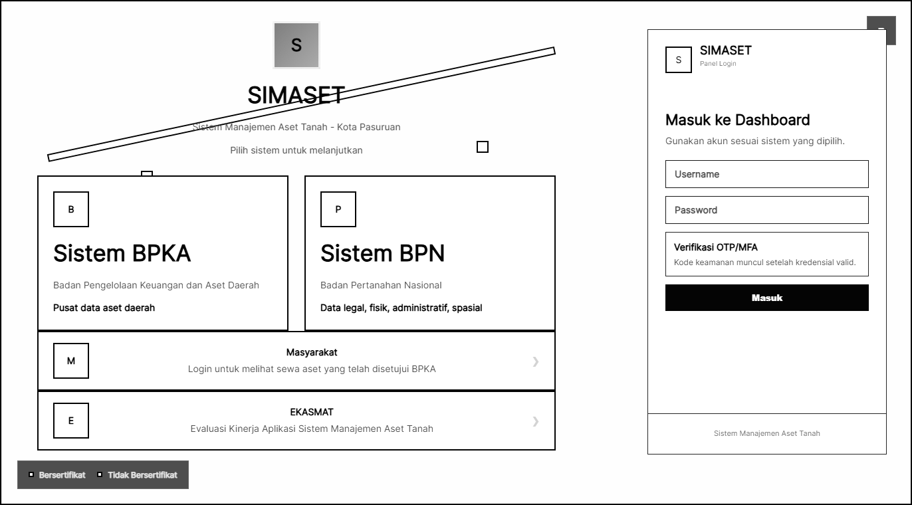

Halaman login digunakan sebagai halaman pemilihan sistem. Pengguna dapat memilih Sistem BPKA, Sistem BPN, portal masyarakat, atau EKASMAT sesuai kebutuhan dan hak akses. Tampilan ini juga menampilkan panel login untuk memasukkan username, password, dan verifikasi keamanan.

#### b. Tampilan Dashboard

**Gambar 21. Dashboard Utama**

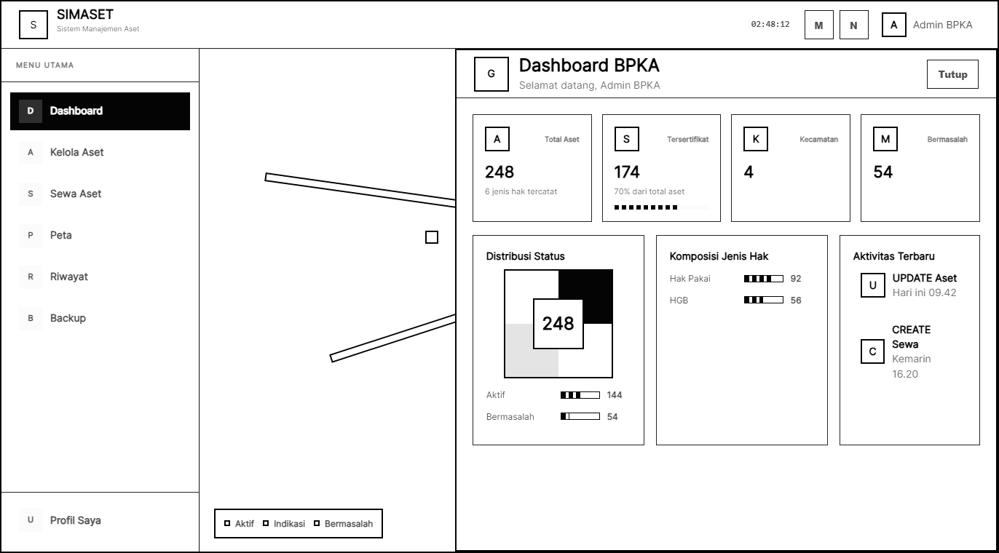

Dashboard menampilkan ringkasan kondisi aset, statistik, grafik, peta ringkas, dan aktivitas terbaru. Pada SIMASET, dashboard diarahkan agar peta menjadi tampilan awal untuk membantu pengguna memahami kondisi aset secara spasial.

#### c. Tampilan Kelola Aset

**Gambar 22. Halaman Kelola Aset**

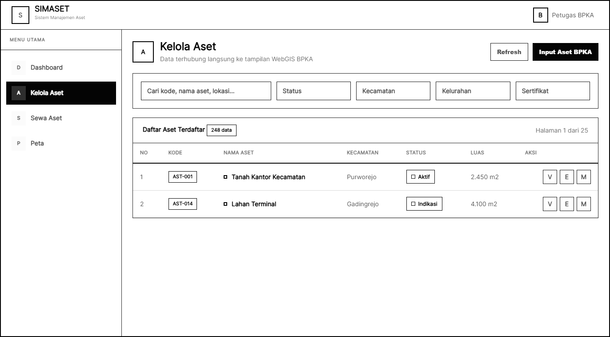

Halaman kelola aset digunakan untuk menampilkan daftar aset, melakukan pencarian, filter, tambah data, ubah data, hapus data, dan melihat detail aset. Hak akses pada halaman ini disesuaikan dengan role pengguna.

#### d. Tampilan Data Substansi

**Gambar 23. Halaman Data Legal, Fisik, Administratif, dan Spasial**

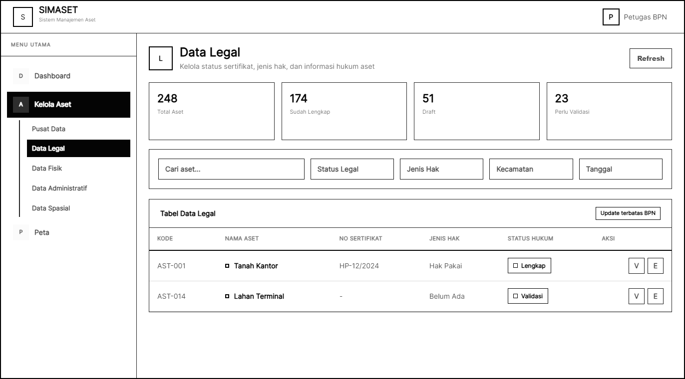

Halaman data substansi digunakan oleh BPN untuk memperbarui data legal, fisik, administratif, dan spasial. Halaman ini membantu pemisahan tanggung jawab antara pengelolaan aset daerah dan pembaruan informasi pertanahan.

#### e. Tampilan Pusat Data

**Gambar 24. Halaman Pusat Data**

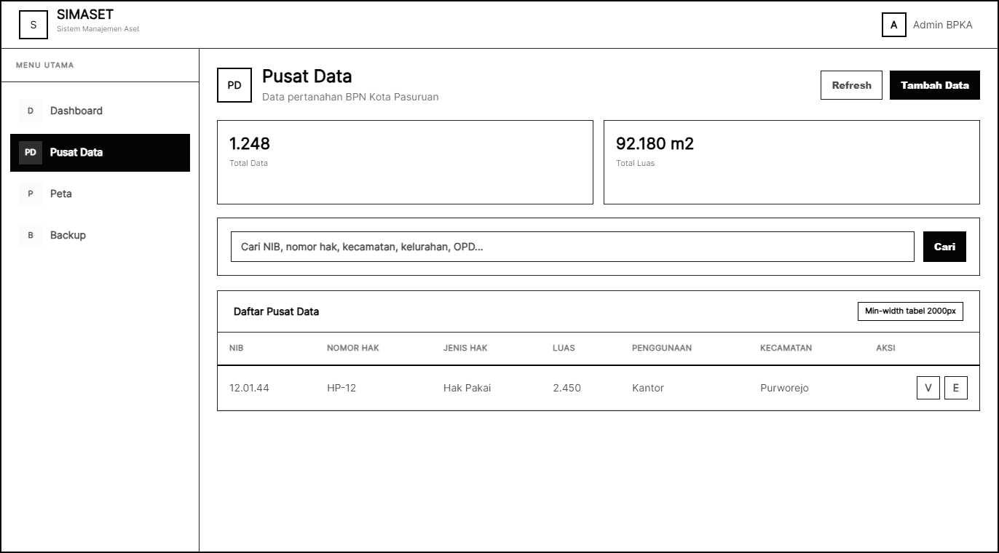

Halaman pusat data digunakan untuk mengelola repositori data aset BPKAD. Halaman ini menyediakan filter kecamatan, kelurahan, pencarian data, peta ringkas, dan tabel data pusat.

#### f. Tampilan Peta Interaktif

**Gambar 25. Halaman Peta Interaktif**

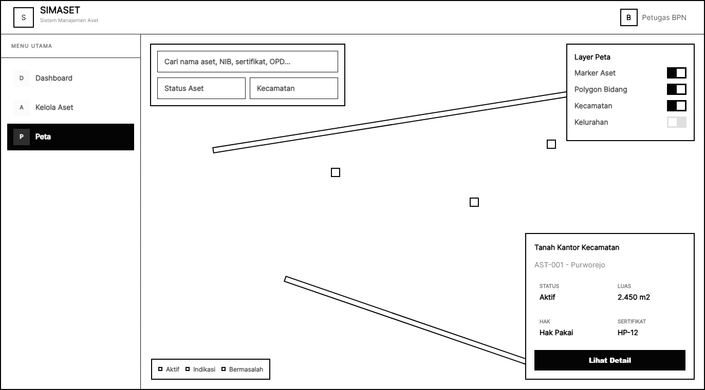

Halaman peta interaktif menampilkan aset dalam bentuk spasial. Pengguna dapat memilih layer, melakukan pencarian, filter status, melihat legenda, dan membuka panel detail aset.

#### g. Tampilan Penyewaan dan Permintaan Sewa

**Gambar 26. Halaman Penyewaan**

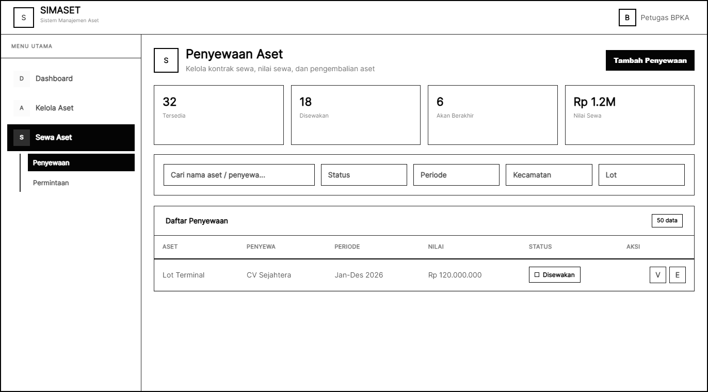

Halaman penyewaan digunakan oleh BPKAD untuk mengelola data aset yang disewakan, status sewa, nilai sewa, periode sewa, dokumen kontrak, dan pengembalian aset.

**Gambar 27. Halaman Permintaan Sewa**

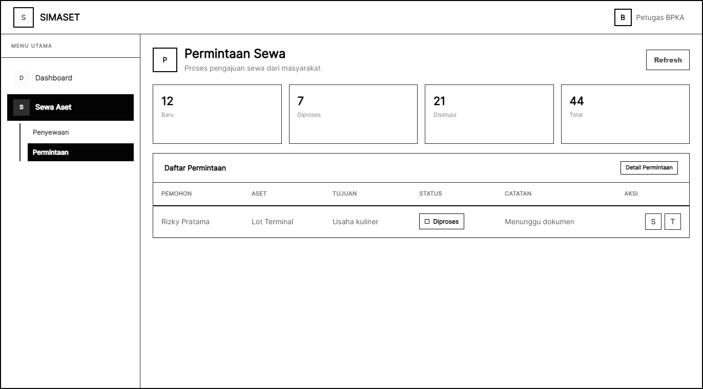

Halaman permintaan sewa digunakan untuk memproses permintaan yang diajukan oleh masyarakat. Petugas dapat melihat detail permintaan, mengubah status, memberikan catatan, dan mengunggah dokumen respons.

**Gambar 28. Halaman Aset Tersedia Masyarakat**

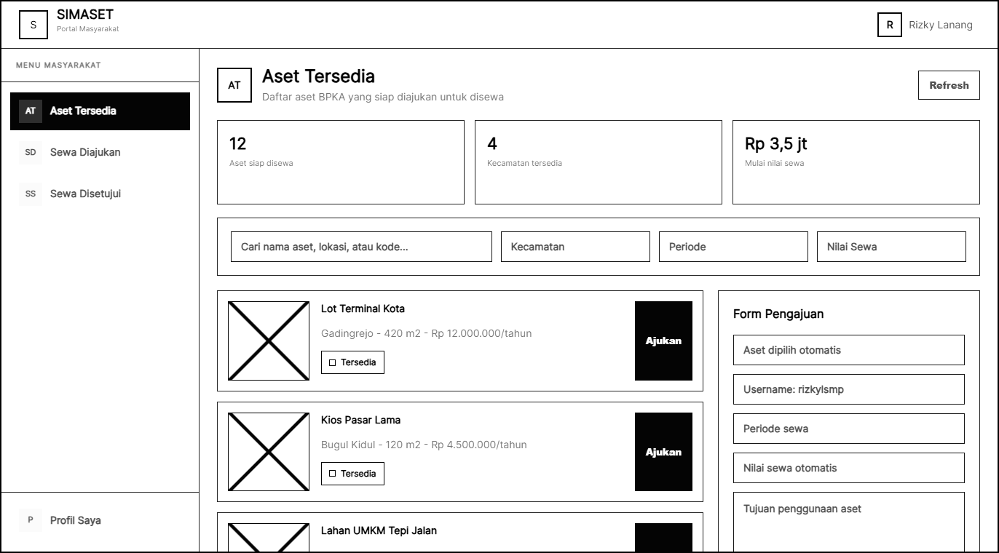

Halaman aset tersedia masyarakat digunakan masyarakat untuk melihat aset yang siap disewa, memilih periode sewa, melihat nilai sewa otomatis, dan mengirim pengajuan berdasarkan akun yang sedang login.

**Gambar 29. Halaman Sewa Diajukan Masyarakat**

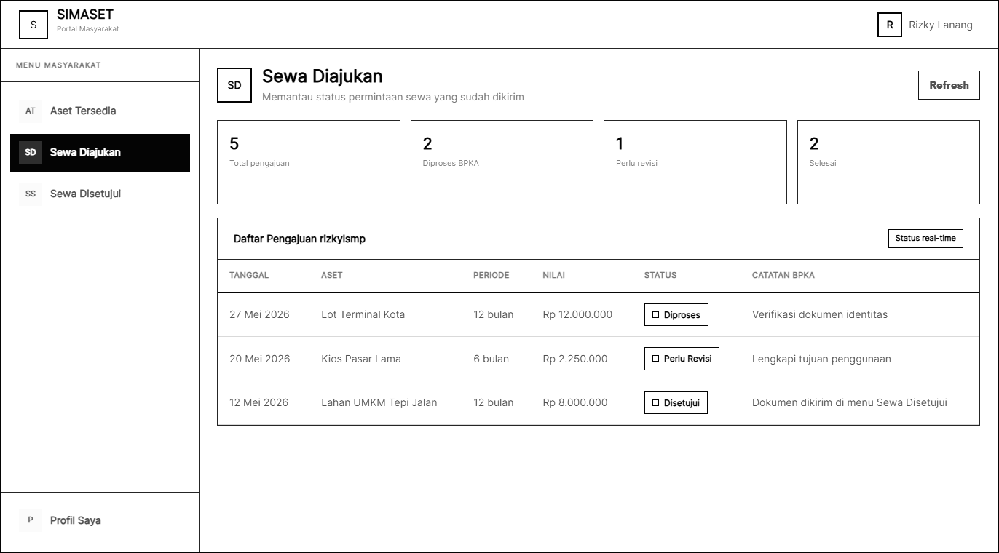

Halaman sewa diajukan masyarakat digunakan untuk memantau status pengajuan, catatan dari BPKA, periode, dan nilai sewa dari setiap pengajuan milik username masyarakat.

**Gambar 30. Halaman Sewa Disetujui Masyarakat**

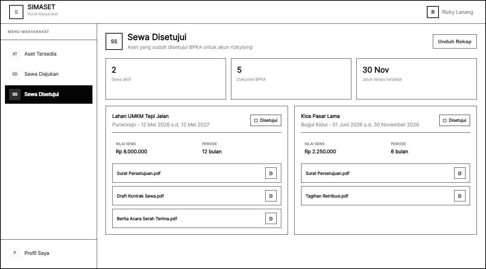

Halaman sewa disetujui masyarakat digunakan untuk melihat aset sewa yang telah disetujui oleh BPKA serta menerima dokumen yang dikirimkan BPKA, seperti surat persetujuan, kontrak, berita acara, atau tagihan.

#### h. Tampilan Riwayat, Notifikasi, Backup, Profil, dan Pengaturan

**Gambar 31. Halaman Riwayat**

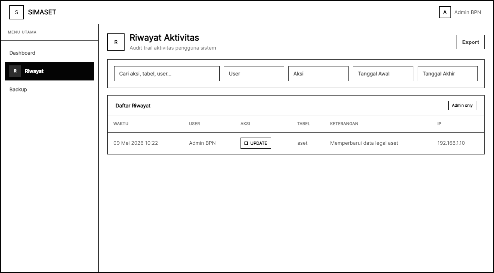

Halaman riwayat digunakan oleh admin untuk melihat catatan aktivitas pengguna. Data riwayat mendukung audit dan penelusuran perubahan data.

**Gambar 32. Halaman Notifikasi**

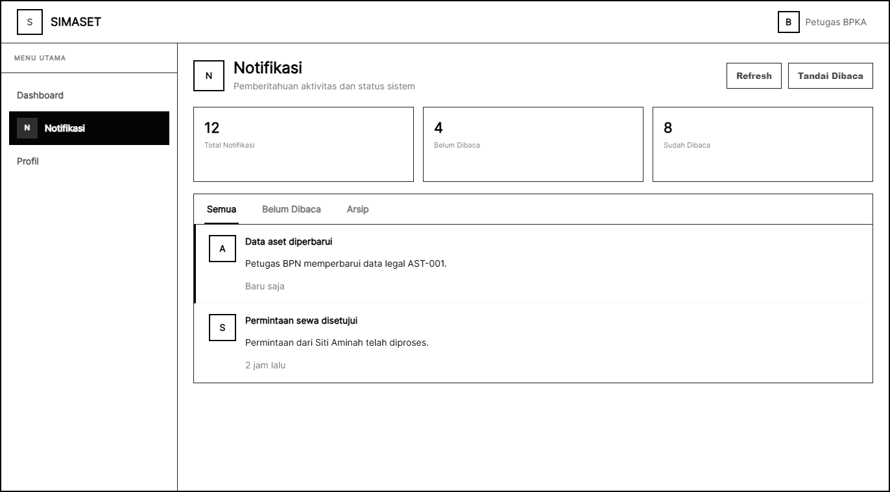

Halaman notifikasi digunakan untuk menampilkan pemberitahuan sistem, status baca, dan informasi penting kepada pengguna.

**Gambar 33. Halaman Backup**

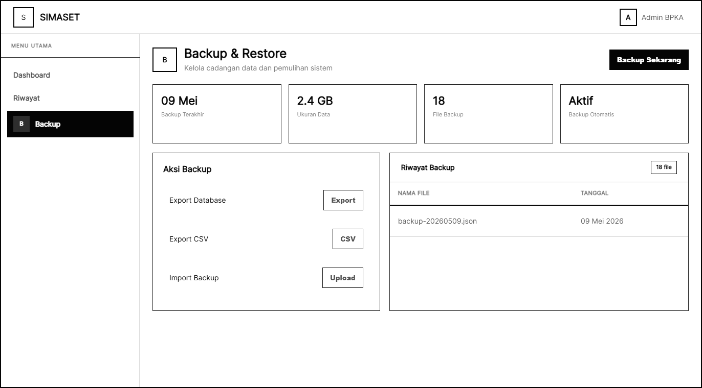

Halaman backup digunakan oleh admin untuk melakukan export, import, download, hapus backup, dan export CSV.

**Gambar 34. Halaman Profil dan Pengaturan**

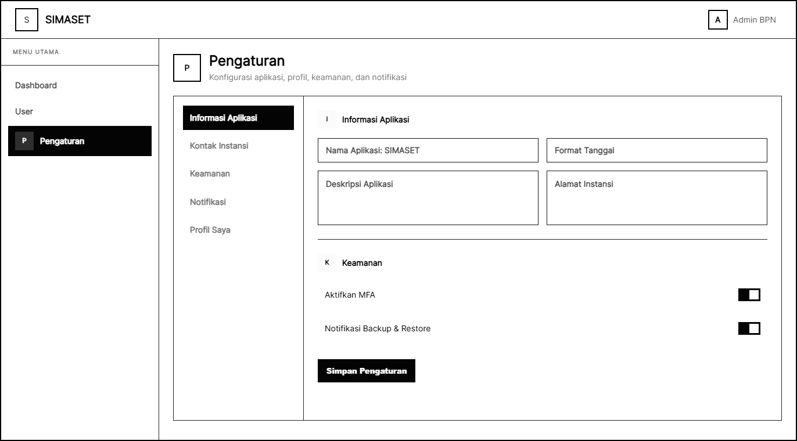

Halaman profil dan pengaturan digunakan untuk mengelola informasi pengguna, keamanan akun, preferensi, dan konfigurasi sistem.

#### i. Tampilan EKASMAT

**Gambar 35. Halaman EKASMAT**

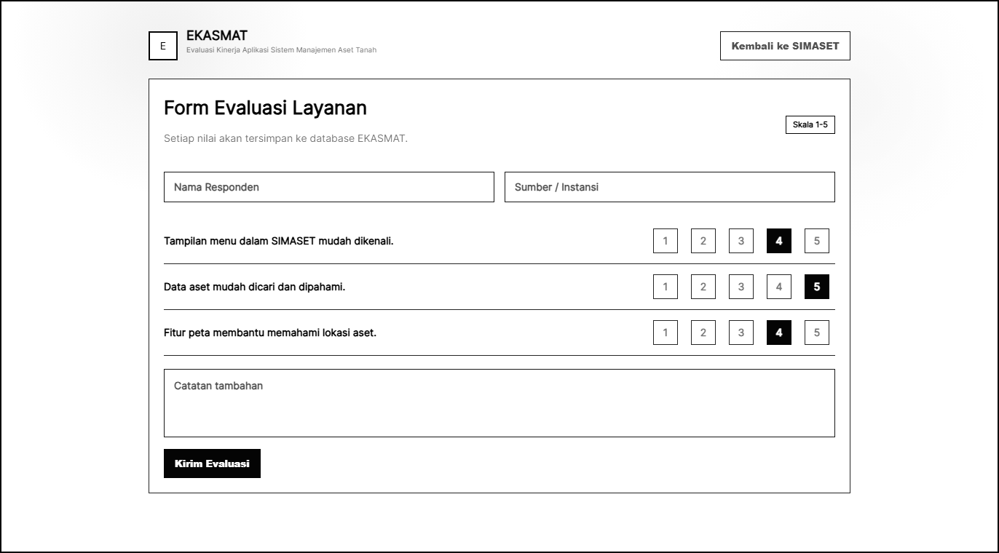

Halaman EKASMAT digunakan untuk mengisi evaluasi kinerja aplikasi. Data yang dikirimkan berisi nama responden, sumber responden, skor penilaian, dan waktu pengisian.

### 4. Pengujian Sistem dan Evaluasi Pengguna

Pengujian sistem dilakukan untuk memastikan bahwa fitur SIMASET berjalan sesuai kebutuhan. Pengujian disusun menggunakan pendekatan blackbox testing, yaitu pengujian berdasarkan input dan output sistem tanpa melihat kode program secara langsung. Pengujian juga dilengkapi dengan evaluasi pengguna melalui EKASMAT.

**Tabel 9. Test Case SIMASET**

| No | Pengujian | Indikator | Hasil Uji |
| -- | --------- | --------- | -------- |
| 1 | Login pengguna | Pengguna dapat masuk ke dashboard sesuai role | Berfungsi dengan baik |
| 2 | Logout pengguna | Sesi pengguna berakhir dan token dihapus | Berfungsi dengan baik |
| 3 | Role guard menu | Menu tampil sesuai hak akses pengguna | Berfungsi dengan baik |
| 4 | Tambah data aset | Data aset baru tersimpan pada database | Berfungsi dengan baik |
| 5 | Ubah data aset | Data aset berubah sesuai input pengguna | Berfungsi dengan baik |
| 6 | Hapus data aset | Data aset dapat dihapus sesuai hak akses | Berfungsi dengan baik |
| 7 | Pencarian aset | Sistem menampilkan aset sesuai kata kunci | Berfungsi dengan baik |
| 8 | Filter aset | Sistem menampilkan aset sesuai status/lokasi | Berfungsi dengan baik |
| 9 | Data substansi legal | BPN dapat memperbarui data sertifikat dan status hukum | Berfungsi dengan baik |
| 10 | Data substansi fisik | BPN dapat memperbarui lokasi, luas, dan batas tanah | Berfungsi dengan baik |
| 11 | Data substansi administratif | BPN dapat memperbarui data administratif dan keuangan | Berfungsi dengan baik |
| 12 | Data substansi spasial | BPN dapat memperbarui koordinat dan polygon bidang | Berfungsi dengan baik |
| 13 | Pusat data | BPKAD dapat mengelola pusat data dan role lain dapat melihat | Berfungsi dengan baik |
| 14 | Peta interaktif | Marker, layer, filter, dan detail aset tampil pada peta | Berfungsi dengan baik |
| 15 | Tambah data sewa | Data penyewaan aset dapat disimpan | Berfungsi dengan baik |
| 16 | Pengembalian aset | Status pengembalian dan kondisi aset dapat dicatat | Berfungsi dengan baik |
| 17 | Permintaan sewa publik | Masyarakat dapat mengirim permintaan sewa | Berfungsi dengan baik |
| 18 | Proses permintaan sewa | Petugas dapat mengubah status dan memberi catatan | Berfungsi dengan baik |
| 19 | Notifikasi | Notifikasi dapat ditampilkan dan dibaca | Berfungsi dengan baik |
| 20 | Riwayat aktivitas | Aktivitas penting dapat dicatat sebagai audit trail | Berfungsi dengan baik |
| 21 | Backup export | Admin dapat membuat file backup | Berfungsi dengan baik |
| 22 | Backup import | Admin dapat mengimpor data backup | Berfungsi dengan baik |
| 23 | Manajemen pengguna | Admin dapat menambah, mengubah, dan menonaktifkan pengguna | Berfungsi dengan baik |
| 24 | Profil dan password | Pengguna dapat mengubah profil dan password | Berfungsi dengan baik |
| 25 | MFA | Pengguna dapat melakukan setup, verifikasi, dan disable MFA | Berfungsi dengan baik |
| 26 | EKASMAT | Responden dapat mengirim skor evaluasi aplikasi | Berfungsi dengan baik |

Selain blackbox testing, sistem juga memiliki pengujian unit untuk beberapa bagian penting. Frontend menggunakan Vitest untuk menguji permission dan auth store, sedangkan backend menggunakan node test untuk menguji middleware autentikasi dan service OTP. Pengujian tersebut membantu memastikan bahwa kontrol akses, token, role, dan penyimpanan sesi berjalan lebih aman.

Evaluasi pengguna dilakukan melalui EKASMAT. Instrumen EKASMAT memiliki 11 pertanyaan dengan skala nilai 1 sampai 5. Data awal yang tersimpan pada aplikasi terdiri dari 10 responden dengan total 110 jawaban. Hasil rekapitulasi menunjukkan total skor 499 dari skor maksimum 550, rata-rata skor 4,54, dan indeks kepuasan 90,73 persen.

**Tabel 10. Rekapitulasi Evaluasi EKASMAT**

| No | Indikator | Nilai |
| -- | --------- | ----- |
| 1 | Jumlah responden | 10 orang |
| 2 | Jumlah pertanyaan | 11 pertanyaan |
| 3 | Total jawaban | 110 jawaban |
| 4 | Total skor | 499 |
| 5 | Skor maksimum | 550 |
| 6 | Rata-rata skor | 4,54 |
| 7 | Indeks kepuasan | 90,73 persen |
| 8 | Predikat | Sangat puas |

**Tabel 11. Rata-rata Tiap Pertanyaan EKASMAT**

| No | Pertanyaan | Rata-rata | Predikat |
| -- | ---------- | --------- | -------- |
| 1 | Informasi yang disediakan oleh SIMASET mudah dimengerti. | 4,60 | Sangat puas |
| 2 | Menu atau fitur dalam SIMASET mudah digunakan. | 4,50 | Sangat puas |
| 3 | SIMASET nyaman digunakan. | 4,70 | Sangat puas |
| 4 | Secara keseluruhan penggunaan SIMASET memuaskan. | 4,50 | Sangat puas |
| 5 | SIMASET sesuai dengan kebutuhan pengelolaan aset tanah. | 4,50 | Sangat puas |
| 6 | SIMASET mudah dipelajari oleh pengguna. | 4,40 | Sangat puas |
| 7 | SIMASET mudah dioperasikan. | 4,50 | Sangat puas |
| 8 | Pengguna dapat dengan mudah menghindari kesalahan saat menggunakan SIMASET. | 4,50 | Sangat puas |
| 9 | SIMASET bermanfaat bagi pengguna dalam pengelolaan aset tanah. | 4,70 | Sangat puas |
| 10 | Tampilan menu dalam SIMASET mudah dikenali. | 4,50 | Sangat puas |
| 11 | SIMASET memiliki fungsi dan kemampuan sesuai dengan yang diharapkan. | 4,50 | Sangat puas |

Berdasarkan hasil evaluasi tersebut, SIMASET memperoleh penilaian sangat positif dari pengguna. Nilai tertinggi terdapat pada indikator kenyamanan penggunaan dan manfaat sistem, masing-masing dengan rata-rata 4,70. Nilai terendah terdapat pada indikator kemudahan dipelajari dengan rata-rata 4,40, tetapi masih berada dalam kategori sangat puas. Hal ini menunjukkan bahwa sistem telah memenuhi kebutuhan utama pengguna, namun tetap membutuhkan pendampingan atau panduan penggunaan agar proses adaptasi berjalan lebih baik.

# BAB VII
# IMPLEMENTASI SISTEM INFORMASI MANAJEMEN ASET TANAH "SIMASET" KOTA PASURUAN

## A. Skenario Pelaksanaan Tugas

SIMASET merupakan sistem informasi yang digunakan untuk mendukung pengelolaan aset tanah melalui integrasi data administratif, data pertanahan, data spasial, penyewaan aset, permintaan sewa, notifikasi, riwayat aktivitas, backup data, dan evaluasi layanan. Implementasi sistem dilakukan melalui skenario pelaksanaan tugas yang menggambarkan bagaimana pengguna menjalankan aktivitas utama pada sistem.

### 1. Login dan Akses Dashboard

Skenario pertama adalah proses login pengguna internal. Pengguna membuka halaman login, memasukkan username dan password, kemudian sistem memvalidasi akun. Apabila akun valid, sistem membuat token sesi dan menampilkan dashboard sesuai role pengguna. Jika MFA aktif, sistem meminta kode autentikasi sebelum pengguna dapat masuk ke dashboard.

**Gambar 34. Kegiatan Login Pengguna**


Setelah berhasil login, pengguna diarahkan ke dashboard. Dashboard menampilkan peta ringkas, statistik aset, grafik, dan informasi aktivitas. Dashboard membantu pengguna memperoleh gambaran awal mengenai kondisi aset tanah.

**Gambar 35. Kegiatan Monitoring Dashboard**


### 2. Proses Pengelolaan Data Pengguna dan Hak Akses

Pengelolaan pengguna dilakukan oleh Admin BPKAD dan Admin BPN. Admin dapat menambah akun pengguna, memperbarui data profil, mengatur role, mengaktifkan atau menonaktifkan akun, serta melakukan reset password apabila diperlukan. Pembagian role menjadi dasar untuk menentukan menu dan aksi yang dapat dilakukan oleh setiap pengguna.

Role yang digunakan dalam SIMASET adalah admin_bpka, admin_bpn, bpka, dan bpn. Dalam naskah akademik ini, role bpka merujuk pada BPKAD sebagai instansi pengelola aset daerah. Setiap role memiliki hak akses berbeda. Admin memiliki akses administratif, BPKAD memiliki akses pengelolaan aset daerah dan sewa, sedangkan BPN memiliki akses pembaruan data substansi pertanahan.

### 3. Proses Input dan Pembaruan Data Aset

Pengelolaan data aset dilakukan melalui halaman kelola aset. Pengguna yang memiliki hak akses membuka halaman aset, memilih tombol tambah data, mengisi identitas aset, lokasi, luas, status, nilai aset, data sertifikat, dan keterangan pendukung. Data yang telah diisi kemudian disimpan ke database.

**Gambar 36. Kegiatan Kelola Data Aset**


Pada halaman ini, pengguna juga dapat melakukan pencarian, filter, melihat detail, mengubah data, dan menghapus data. Proses perubahan data dicatat pada riwayat aktivitas untuk mendukung audit. Dengan adanya riwayat, admin dapat menelusuri perubahan yang terjadi pada data aset.

### 4. Proses Pengelolaan Data Substansi BPN

Petugas BPN mengelola data substansi pertanahan melalui halaman data legal, fisik, administratif, dan spasial. Data legal berisi informasi sertifikat, jenis hak, atas nama, tanggal sertifikat, riwayat perolehan, dan status hukum. Data fisik berisi lokasi, luas, batas tanah, kecamatan, desa atau kelurahan, dan penggunaan aset. Data administratif berisi kode BMD, nilai buku, nilai NJOP, SK penetapan, dan OPD pengguna. Data spasial berisi koordinat dan polygon bidang tanah.

**Gambar 37. Kegiatan Pengelolaan Data Substansi**


Pembaruan data substansi diperlukan agar data aset tidak hanya berfungsi sebagai catatan administratif, tetapi juga mencerminkan kondisi pertanahan dan lokasi bidang tanah. Pembagian kewenangan ini menjaga agar perubahan data pertanahan dilakukan oleh pihak yang memiliki kompetensi dan kewenangan.

### 5. Proses Pengelolaan Pusat Data BPKAD

Pusat data digunakan sebagai repositori aset BPKAD. Petugas BPKAD membuka halaman pusat data, melihat daftar data, melakukan filter berdasarkan kecamatan atau kelurahan, serta menambah atau memperbarui data apabila diperlukan. Data pusat dapat dibaca oleh role internal sebagai referensi pengelolaan aset.

**Gambar 38. Kegiatan Pengelolaan Pusat Data**


Pusat data membantu menyatukan informasi aset daerah dalam satu tempat. Dengan demikian, proses pemeriksaan dan pencocokan data dapat dilakukan lebih cepat.

### 6. Proses Monitoring Peta Interaktif

Peta interaktif digunakan oleh pengguna internal untuk melihat lokasi aset secara spasial. Pengguna membuka halaman peta, memilih layer, menggunakan pencarian, menerapkan filter status, dan membuka detail aset. Sistem menampilkan marker, polygon, legenda, serta panel detail.

**Gambar 39. Kegiatan Monitoring Peta Interaktif**


Peta interaktif menjadi salah satu fitur utama karena dapat menghubungkan data tekstual dengan data spasial. Pengguna dapat mengetahui aset mana yang aktif, bermasalah, indikasi bermasalah, diblokir, tersedia untuk disewa, atau sedang disewakan.

### 7. Proses Penyewaan dan Pengembalian Aset

Pengelolaan sewa aset dilakukan oleh BPKAD. Petugas membuka halaman penyewaan, memilih aset, mengisi data penyewa, periode sewa, nilai sewa, periode pembayaran, nomor kontrak, dokumen pendukung, foto sewa, dan polygon sewa apabila diperlukan. Setelah data tersimpan, sistem menampilkan status penyewaan.

**Gambar 40. Kegiatan Penyewaan Aset**


Apabila masa sewa berakhir atau aset dikembalikan, petugas dapat mencatat tanggal pengembalian, kondisi pengembalian, catatan pengembalian, dan foto kondisi. Status aset dapat berubah menjadi tersedia, disewakan, akan berakhir, berakhir, dikembalikan, atau dibatalkan sesuai kondisi.

### 8. Proses Permintaan Sewa oleh Masyarakat

Masyarakat dapat masuk ke portal masyarakat untuk membuka menu aset tersedia. Pada halaman tersebut, masyarakat melihat daftar aset yang tersedia, memilih aset yang diminati, memilih periode sewa, melihat nilai sewa otomatis, kemudian mengisi tujuan penggunaan aset. Data pengajuan disimpan berdasarkan username masyarakat yang sedang login.

**Gambar 41. Kegiatan Pengajuan Permintaan Sewa Masyarakat**


Permintaan yang masuk dapat diproses oleh BPKAD melalui halaman permintaan sewa. Petugas dapat melihat detail permohonan, mengubah status menjadi diproses, disetujui, atau ditolak, serta menambahkan catatan admin.

**Gambar 42. Kegiatan Pemrosesan Permintaan Sewa**


### 9. Proses Notifikasi, Riwayat, dan Backup Data

Notifikasi digunakan untuk memberikan informasi kepada pengguna mengenai aktivitas atau informasi sistem. Pengguna dapat membuka halaman notifikasi dan menandai notifikasi sebagai telah dibaca.

**Gambar 43. Kegiatan Notifikasi Sistem**


Riwayat aktivitas digunakan oleh admin untuk memantau aktivitas pengguna. Data riwayat mencatat aksi, tabel, referensi data, data lama, data baru, keterangan, IP address, user agent, user_id, dan waktu aktivitas.

**Gambar 44. Kegiatan Pemantauan Riwayat Aktivitas**


Backup data digunakan oleh admin untuk menjaga ketersediaan data. Admin dapat melakukan export backup, upload file backup, import backup, download backup, hapus backup, dan export CSV.

**Gambar 45. Kegiatan Backup Data**


### 10. Proses Pengisian EKASMAT

EKASMAT digunakan untuk mengumpulkan evaluasi pengguna terhadap SIMASET. Responden membuka halaman EKASMAT, mengisi nama dan sumber, memberikan nilai pada 11 pertanyaan, kemudian mengirimkan evaluasi. Sistem menyimpan data ke tabel ekasmat_responses.

**Gambar 46. Kegiatan Pengisian EKASMAT**


Hasil evaluasi digunakan untuk mengetahui tingkat kepuasan pengguna dan menjadi masukan dalam pengembangan sistem berikutnya. Data evaluasi juga dapat menjadi bukti bahwa sistem telah diuji dan digunakan oleh calon pengguna.

## B. Kelebihan dan Kekurangan Sistem Informasi

Sistem informasi yang dibangun telah melalui tahapan perancangan, pengkodean, pengujian, dan evaluasi awal. SIMASET memiliki beberapa kelebihan yang mendukung pengelolaan aset tanah, namun juga memiliki beberapa kekurangan yang perlu diperhatikan untuk pengembangan lanjutan.

### 1. Kelebihan

a. SIMASET berbasis web sehingga dapat diakses melalui browser modern pada perangkat desktop maupun mobile.  
b. Sistem mengintegrasikan data administratif, data pertanahan, data spasial, sewa aset, permintaan sewa, riwayat, notifikasi, backup, dan evaluasi layanan.  
c. Sistem menerapkan role-based access control sehingga akses pengguna dapat dibatasi berdasarkan kewenangan.  
d. Peta interaktif membantu pengguna memahami lokasi aset, status aset, dan konteks wilayah secara visual.  
e. Modul pusat data membantu BPKAD menyimpan dan memeriksa data aset daerah secara lebih terstruktur.  
f. Modul data substansi membantu BPN memperbarui data legal, fisik, administratif, dan spasial.  
g. Modul sewa aset mendukung pencatatan penyewaan, pengembalian, status sewa, nilai sewa, dan dokumen pendukung.  
h. Portal masyarakat memudahkan masyarakat melihat aset tersedia, mengajukan sewa, memantau pengajuan, dan menerima dokumen sewa yang telah disetujui BPKA.  
i. Riwayat aktivitas mendukung audit trail dan penelusuran perubahan data.  
j. Backup data membantu admin menjaga ketersediaan data dan mendukung pemulihan apabila terjadi gangguan.  
k. EKASMAT menyediakan media evaluasi pengguna terhadap aplikasi.  
l. Struktur frontend dan backend modular sehingga lebih mudah dipelihara dan dikembangkan.

### 2. Kekurangan

a. Sistem masih bergantung pada ketersediaan server, database, koneksi internet, dan layanan penyimpanan file.  
b. Pengguna baru membutuhkan pelatihan agar dapat memahami alur kerja, terutama pada modul peta, data substansi, dan penyewaan aset.  
c. Kualitas data sangat bergantung pada kedisiplinan input dan pemutakhiran data oleh petugas.  
d. Integrasi data BPKAD dan BPN masih membutuhkan proses validasi agar tidak terjadi perbedaan data.  
e. Pengujian performa beban besar belum dilakukan secara mendalam, sehingga perlu uji lanjutan apabila jumlah data dan pengguna meningkat.  
f. Keamanan sistem perlu terus diperkuat melalui HTTPS, rotasi secret, pembatasan akses server, backup berkala, dan monitoring.  
g. Evaluasi EKASMAT masih perlu diperluas dengan jumlah responden yang lebih banyak agar hasilnya lebih representatif.  
h. Sistem perlu disiapkan dengan panduan operasional tertulis agar penggunaan di instansi dapat berjalan konsisten.

# LAMPIRAN

## Lampiran 1. Kuisioner EKASMAT

Kuisioner EKASMAT digunakan untuk mengevaluasi kinerja aplikasi SIMASET. Responden memberikan nilai 1 sampai 5 dengan keterangan sebagai berikut: 1 = sangat tidak setuju, 2 = tidak setuju, 3 = netral, 4 = setuju, dan 5 = sangat setuju.

| No | Pertanyaan |
| -- | ---------- |
| 1 | Informasi yang disediakan oleh SIMASET mudah dimengerti. |
| 2 | Menu atau fitur dalam SIMASET mudah digunakan. |
| 3 | SIMASET nyaman digunakan. |
| 4 | Secara keseluruhan penggunaan SIMASET memuaskan. |
| 5 | SIMASET sesuai dengan kebutuhan pengelolaan aset tanah. |
| 6 | SIMASET mudah dipelajari oleh pengguna. |
| 7 | SIMASET mudah dioperasikan. |
| 8 | Pengguna dapat dengan mudah menghindari kesalahan saat menggunakan SIMASET. |
| 9 | SIMASET bermanfaat bagi pengguna dalam pengelolaan aset tanah. |
| 10 | Tampilan menu dalam SIMASET mudah dikenali. |
| 11 | SIMASET memiliki fungsi dan kemampuan sesuai dengan yang diharapkan. |

## Lampiran 2. Panduan Wawancara

Panduan wawancara digunakan untuk menggali kebutuhan pengguna sebelum dan sesudah penggunaan SIMASET.

| No | Pertanyaan Wawancara |
| -- | -------------------- |
| 1 | Bagaimana proses pengelolaan data aset tanah sebelum SIMASET digunakan? |
| 2 | Apa kendala utama dalam pencarian dan pemutakhiran data aset? |
| 3 | Data apa saja yang perlu tersedia dalam sistem? |
| 4 | Bagaimana proses sinkronisasi data antara BPKAD dan BPN dilakukan? |
| 5 | Fitur apa yang paling dibutuhkan untuk membantu pekerjaan harian? |
| 6 | Bagaimana kebutuhan akses dan pembagian kewenangan pengguna? |
| 7 | Apakah peta interaktif membantu dalam memahami lokasi aset? |
| 8 | Bagaimana proses penyewaan aset sebaiknya dilakukan dalam sistem? |
| 9 | Apakah sistem perlu menyediakan riwayat aktivitas dan backup data? |
| 10 | Saran apa yang diberikan untuk pengembangan SIMASET berikutnya? |

## Lampiran 3. Basis Data

Basis data SIMASET terdiri dari tabel utama berikut:

| No | Tabel | Fungsi |
| -- | ----- | ------ |
| 1 | users | Menyimpan akun, role, profil, status aktif, dan konfigurasi MFA |
| 2 | aset | Menyimpan data aset tanah, data legal, fisik, administratif, spasial, dan KIB |
| 3 | pusat_data | Menyimpan repositori data aset BPKAD |
| 4 | sewa_aset | Menyimpan data penyewaan, penyewa, periode, nilai, status, dan pengembalian |
| 5 | permintaan_sewa | Menyimpan permintaan sewa dari masyarakat |
| 6 | riwayat | Menyimpan catatan aktivitas pengguna |
| 7 | notifikasi | Menyimpan pemberitahuan sistem |
| 8 | ekasmat_responses | Menyimpan respons evaluasi EKASMAT |

## Lampiran 4. Daftar Jawaban Responden EKASMAT

Data awal EKASMAT yang digunakan pada aplikasi berjumlah 10 responden.

| No | Responden | Sumber | Skor |
| -- | --------- | ------ | ---- |
| 1 | Febri Ardiyanto | Umum | 5,5,5,5,5,5,5,5,5,5,5 |
| 2 | Agus Andrijono | BPKA | 5,5,5,5,5,5,5,5,5,5,5 |
| 3 | Dani M | BPKA | 5,4,5,5,5,5,5,4,5,4,5 |
| 4 | Mohammad Khisanul Masobih, S.Kom | BPKA | 4,4,5,4,4,4,4,5,5,4,5 |
| 5 | Sumarto | BPKA | 4,4,4,4,4,4,4,4,4,4,4 |
| 6 | Yudy | BPKA | 4,4,4,4,4,4,4,4,4,4,4 |
| 7 | Lutfi | BPKA | 5,5,5,5,5,4,4,5,5,5,4 |
| 8 | Sumarto | BPKA | 4,4,4,4,4,4,4,4,4,4,4 |
| 9 | Hariyanto | BPKA | 5,5,5,5,5,5,5,5,5,5,5 |
| 10 | Dwi Andi Oktavianus | BPKA | 5,5,5,4,4,4,5,4,5,5,4 |

## Lampiran 5. Diagram Basis Data

Diagram basis data disajikan dalam bentuk ERD berikut.


## Lampiran 6. Skema Alur Sistem Informasi SIMASET

Skema alur sistem informasi disajikan melalui proses bisnis, DFD, use case, activity diagram, dan sequence diagram. File gambar tersedia pada folder `documents/bab5/gambar`.

| No | Gambar | File |
| -- | ------ | ---- |
| 1 | Proses bisnis sebelum SIMASET | `gambar/gambar-5-01-proses-bisnis-sebelum-simaset.png` |
| 2 | Proses bisnis setelah SIMASET | `gambar/gambar-5-02-proses-bisnis-setelah-simaset.png` |
| 3 | Use case diagram | `gambar/gambar-5-03-use-case-simaset.png` |
| 4 | DFD Level 0 | `gambar/gambar-5-04-dfd-simaset.png` |
| 5 | Activity diagram | `gambar/gambar-5-05` sampai `gambar-5-12` |
| 6 | Class diagram | `gambar/gambar-5-13-class-diagram-simaset.png` |
| 7 | ERD | `gambar/gambar-5-14-erd-simaset.png` |
| 8 | Sequence diagram | `gambar/gambar-5-15` sampai `gambar-5-20` |

## Lampiran 7. Wireframe Interface

Wireframe interface SIMASET tersedia pada folder `documents/bab5/wireframe`.

| No | Interface | File |
| -- | --------- | ---- |
| 1 | Login | `wireframe/wireframe-5-21-login.png` |
| 2 | Dashboard | `wireframe/wireframe-5-22-dashboard.png` |
| 3 | Kelola aset | `wireframe/wireframe-5-23-kelola-aset.png` |
| 4 | Data substansi | `wireframe/wireframe-5-24-data-substansi.png` |
| 5 | Pusat data | `wireframe/wireframe-5-25-pusat-data.png` |
| 6 | Peta interaktif | `wireframe/wireframe-5-26-peta-interaktif.png` |
| 7 | Penyewaan | `wireframe/wireframe-5-27-penyewaan.png` |
| 8 | Permintaan sewa | `wireframe/wireframe-5-28-permintaan-sewa.png` |
| 9 | Aset tersedia masyarakat | `wireframe/wireframe-5-29-masyarakat-aset-tersedia.png` |
| 10 | Sewa diajukan masyarakat | `wireframe/wireframe-5-30-masyarakat-sewa-diajukan.png` |
| 11 | Sewa disetujui masyarakat | `wireframe/wireframe-5-31-masyarakat-sewa-disetujui.png` |
| 12 | Riwayat | `wireframe/wireframe-5-32-riwayat.png` |
| 13 | Notifikasi | `wireframe/wireframe-5-33-notifikasi.png` |
| 14 | Backup | `wireframe/wireframe-5-34-backup.png` |
| 15 | Profil dan pengaturan | `wireframe/wireframe-5-35-profil-pengaturan.png` |
| 16 | EKASMAT | `wireframe/wireframe-5-36-ekasmat.png` |
