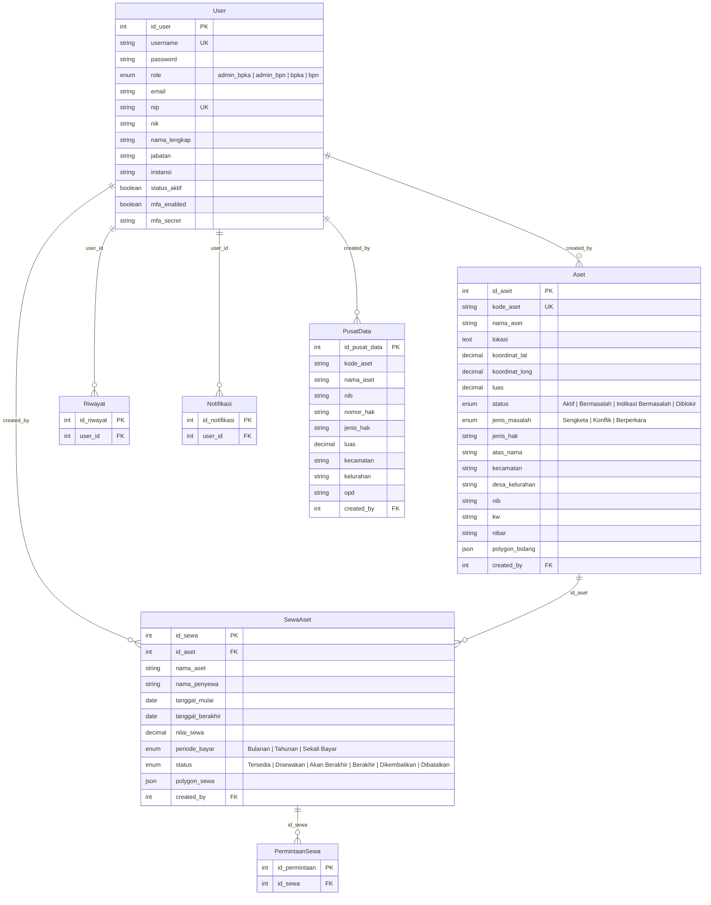

# 📋 Analisis Aplikasi SIMASET

**SIMASET** (Sistem Informasi Manajemen Aset Tanah) adalah aplikasi web full-stack untuk mengelola aset tanah pemerintah daerah. Sistem ini mengintegrasikan data dari berbagai instansi: **BPKAD** (Badan Pengelola Keuangan dan Aset Daerah) dan **BPN** (Badan Pertanahan Nasional) dalam satu platform terpadu.

---

## 🛠️ Tech Stack

| Layer                | Teknologi                             | Keterangan                               |
| -------------------- | ------------------------------------- | ---------------------------------------- |
| **Frontend**         | React 19 + Vite 7                     | SPA dengan HashRouter                    |
| **Styling**          | Tailwind CSS v4                       | Dark mode support via `useThemeStore`    |
| **State Management** | Zustand 5                             | 3 stores: auth, session, theme           |
| **Charts**           | Recharts 3                            | Pie chart, bar chart di dashboard        |
| **Maps**             | Leaflet + React-Leaflet + MapLibre GL | Peta interaktif dengan polygon drawing   |
| **Backend**          | Express.js 4 (ESM)                    | REST API, entry point di `src/server.js` |
| **ORM**              | Sequelize 6                           | Model-based, PostgreSQL dialect          |
| **Database**         | PostgreSQL                            | Cloud DB (Supabase) di production        |
| **Auth**             | JWT + bcrypt                          | Dengan MFA (TOTP via `otpauth`)          |
| **File Upload**      | Multer + Supabase Storage             | Upload sertifikat, foto, dokumen         |
| **Deployment**       | Vercel (serverless)                   | Backend & Frontend terpisah              |

---

## 🗂️ Struktur Proyek

```
Simaset/
├── backend/
│   ├── src/
│   │   ├── config/
│   │   │   ├── database.js          # Sequelize config (PostgreSQL + SSL)
│   │   │   └── sequelize.json       # CLI config
│   │   ├── controllers/             # 11 controller files
│   │   │   ├── aset.controller.js
│   │   │   ├── auth.controller.js
│   │   │   ├── backup.controller.js
│   │   │   ├── notifikasi.controller.js
│   │   │   ├── permintaan.controller.js
│   │   │   ├── peta.controller.js
│   │   │   ├── pusatData.controller.js
│   │   │   ├── riwayat.controller.js
│   │   │   ├── sewaAset.controller.js
│   │   │   └── user.controller.js
│   │   ├── middleware/
│   │   │   └── auth.middleware.js    # JWT auth + RBAC + permissions
│   │   ├── models/                   # 7 Sequelize models
│   │   │   ├── Aset.js
│   │   │   ├── User.js
│   │   │   ├── PusatData.js
│   │   │   ├── SewaAset.js
│   │   │   ├── PermintaanSewa.js
│   │   │   ├── Riwayat.js
│   │   │   ├── Notifikasi.js
│   │   │   └── index.js             # Associations
│   │   ├── routes/                   # 11 route files
│   │   ├── services/
│   │   │   ├── audit.service.js      # Audit trail logging
│   │   │   └── notification.service.js
│   │   ├── utils/
│   │   └── server.js                # Express app + CORS + route mounting
│   ├── seed.js                       # Development seed data
│   ├── seed-production.js            # Production seed (37KB, data real)
│   ├── sync-webgis-all.js            # Sync data dari WebGIS BPN
│   ├── import-excel-bpka.js          # Import data dari Excel BPKAD
│   └── vercel.json                   # Serverless config
│
├── frontend/
│   ├── src/
│   │   ├── components/
│   │   │   ├── asset/                # AssetTable, AssetFormModal, AssetSearch, etc.
│   │   │   ├── charts/               # Recharts wrapper (Pie, Bar)
│   │   │   ├── dashboard/            # DashboardBPKAPanel, DashboardBPNPanel
│   │   │   ├── form/                 # FormInput, FormSelect, FormFileUpload
│   │   │   ├── map/
│   │   │   │   ├── bpkad/            # MapDisplayBPKAD, BPKADLayerControl
│   │   │   │   ├── bpn/              # MapDisplayBPN, BPNLayerControl, MapFilter
│   │   │   │   │                     # MapCoordinatePicker, MapPolygonDrawer
│   │   │   │   └── shared/           # AssetDetailPanel, MapLegend
│   │   │   ├── sewa/                 # SewaFormModal, SewaTable, PolygonDrawMap
│   │   │   └── ui/                   # ConfirmDialog, SessionExpiredDialog
│   │   ├── hooks/
│   │   │   └── useColumnResize.js    # Custom hook untuk resize kolom tabel
│   │   ├── layouts/
│   │   │   ├── RootLayout.jsx        # Main layout dengan sidebar + header
│   │   │   ├── Sidebar.jsx           # Navigation sidebar (role-aware)
│   │   │   └── Header.jsx            # Top header bar
│   │   ├── pages/
│   │   │   ├── auth/LoginPage.jsx    # Login (eagerly loaded)
│   │   │   ├── aset/                 # AssetPage, DataLegalPage, DataFisikPage, etc.
│   │   │   ├── sewa/                 # PenyewaanPage, SewaDetailPage, PermintaanPage
│   │   │   ├── DashboardPage.jsx
│   │   │   ├── MapPage.jsx           # Full-screen map view
│   │   │   ├── PusatDataPage.jsx     # BPKAD data center
│   │   │   ├── RiwayatPage.jsx       # Activity history
│   │   │   ├── NotifikasiPage.jsx
│   │   │   ├── BackupPage.jsx
│   │   │   ├── ProfilPage.jsx
│   │   │   ├── PengaturanPage.jsx
│   │   │   ├── UserManagementPage.jsx
│   │   │   └── LandingPage.jsx       # Public sewa listing (70KB!)
│   │   ├── router/
│   │   │   ├── index.jsx             # HashRouter config (lazy loading)
│   │   │   ├── ProtectedRoute.jsx    # Auth guard
│   │   │   └── RoleGuard.jsx         # Menu-level role guard
│   │   ├── services/
│   │   │   └── api.js                # Axios instance + 10 service modules
│   │   └── stores/
│   │       ├── authStore.js          # User & token state
│   │       ├── sessionStore.js       # Session countdown & expiry
│   │       └── themeStore.js         # Dark mode (persisted)
│   └── index.html
│
├── MindMap.md                        # Domain requirements document
├── Rev1.md                           # Revision notes batch 1
├── Rev2.md                           # Revision notes batch 2
└── README.md
```

---

## 🗃️ Database Models & Relationships



### Catatan Model:

- **Aset** memiliki ~50 field yang sangat detail, dibagi menjadi: Data Legal, Data Fisik, Data Administratif/Keuangan, Data Spasial, dan Data KIB/Excel BPKA
- **PusatData** adalah tabel terpisah khusus BPKAD — data aset daerah yang bisa berbeda dari data BPN
- **SewaAset** mengelola siklus hidup sewa aset tanah, termasuk pengembalian dan polygon area sewa

---

## 🔐 Sistem Autentikasi & Otorisasi

### Roles (4 role)

| Role         | Deskripsi   | Akses Utama                            |
| ------------ | ----------- | -------------------------------------- |
| `admin_bpka` | Admin BPKAD | Full access + backup + user management |
| `admin_bpn`  | Admin BPN   | Full access + backup + user management |
| `bpka`       | Staff BPKAD | CRUD aset, pusat data, peta, riwayat   |
| `bpn`        | Staff BPN   | Read + update aset, peta, notifikasi   |

### Mekanisme Keamanan

1. **JWT Authentication** — Token di header `Authorization: Bearer <token>`
2. **Password Hashing** — bcrypt dengan salt round 10
3. **MFA (TOTP)** — Opsional, menggunakan `otpauth` library + QR code
4. **Session Management** — Countdown timer 2 jam, grace period 5 menit, dialog perpanjangan sesi
5. **Token Refresh** — Endpoint khusus yang menerima expired token (grace 5 menit)
6. **Permission System** — Granular permission constants (23 permissions) yang di-map ke role

### Middleware Chain

```
Request → authMiddleware (JWT verify) → roleMiddleware / permissionMiddleware → Controller
```

Ada preset middleware siap pakai:

- `adminOnly` — hanya admin_bpka & admin_bpn
- `canManageAset` — admin + bpka (CRUD penuh)
- `canUpdateAset` — semua role (termasuk BPN untuk edit substansi)
- `canViewRiwayat` — hanya admin
- `canBackup` — hanya admin
- `canManageUsers` — hanya admin

---

## 🌐 API Endpoints

| Group      | Prefix            | Controller                       | Deskripsi                           |
| ---------- | ----------------- | -------------------------------- | ----------------------------------- |
| Auth       | `/api/auth`       | `auth.controller.js` (19KB)      | Login, register, MFA, refresh token |
| Aset       | `/api/aset`       | `aset.controller.js` (23KB)      | CRUD aset + stats + filter options  |
| Peta       | `/api/peta`       | `peta.controller.js` (17KB)      | Map markers, layers, public markers |
| Riwayat    | `/api/riwayat`    | `riwayat.controller.js` (7KB)    | Activity log + stats                |
| Notifikasi | `/api/notifikasi` | `notifikasi.controller.js` (5KB) | CRUD notifikasi + unread count      |
| Users      | `/api/users`      | `user.controller.js` (12KB)      | User management (admin only)        |
| Pusat Data | `/api/pusat-data` | `pusatData.controller.js` (7KB)  | BPKAD data center                   |
| Sewa       | `/api/sewa`       | `sewaAset.controller.js` (12KB)  | Sewa aset + pengembalian            |
| Permintaan | `/api/permintaan` | `permintaan.controller.js` (6KB) | Permintaan sewa                     |
| Backup     | `/api/backup`     | `backup.controller.js` (13KB)    | Export/import/CSV                   |
| Upload     | `/api/upload`     | upload routes (3KB)              | Single + multi file upload          |

---

## 🗺️ Sistem Peta (GIS)

Fitur peta adalah **core feature** aplikasi ini, dengan arsitektur map yang cukup kompleks:

### Dual Map Engine

- **Leaflet + React-Leaflet** — Untuk marker aset dan polygon
- **MapLibre GL** — Untuk base map tiles yang lebih performa

### Layer System (dari Rev1.md)

| Layer   | Konten                            | User            |
| ------- | --------------------------------- | --------------- |
| Layer 1 | Kecamatan & Kelurahan             | Dashboard       |
| Layer 2 | Status aset (berperkara/indikasi) | Filter peta     |
| Layer 3 | Sewa aset                         | Sewa management |

### Komponen Map Per Role

- **BPKAD** → `MapDisplayBPKAD.jsx` + `BPKADLayerControl.jsx`
- **BPN** → `MapDisplayBPN.jsx` (44KB, paling kompleks) + `BPNLayerControl.jsx` + `MapFilter.jsx`
- **Shared** → `AssetDetailPanel.jsx` + `MapLegend.jsx`

### Fitur Spasial

- **Polygon Drawing** — `MapPolygonDrawer.jsx` (24KB) untuk menggambar polygon bidang tanah
- **Coordinate Picker** — `MapCoordinatePicker.jsx` (12KB) untuk memilih titik koordinat
- **Kecamatan Data** — `kecamatanData.js` berisi boundary data kecamatan/kelurahan

---

## 📊 Dashboard

Dashboard berbeda berdasarkan role:

- **`DashboardBPKAPanel.jsx`** (22KB) — Statistik aset BPKAD, pie chart status, tombol navigasi ke peta
- **`DashboardBPNPanel.jsx`** (24KB) — Statistik data BPN, chart distribusi masalah

Fitur (dari Rev1.md):

- Default tampilkan **peta**, dengan tombol toggle ke **statistik grafik**
- Klik pie chart (misalnya "Berperkara") → navigasi ke peta dengan filter otomatis

---

## 📄 Fitur Utama

### 1. Kelola Aset (BPN)

- **Data Legal** — Sertifikat, jenis hak, riwayat perolehan, status hukum
- **Data Fisik** — Lokasi, luas, batas tanah, dokumentasi foto, penggunaan
- **Data Administratif** — Kode BMD, nilai aset, SK penetapan, OPD pengguna
- **Data Spasial** — Koordinat, polygon GeoJSON, overlay peta
- Full CRUD dengan form modal 50KB (`AssetFormModal.jsx`)

### 2. Pusat Data (BPKAD)

- Data aset daerah terpisah (model `PusatData`)
- Filter kecamatan & kelurahan
- Langsung terhubung ke peta

### 3. Sewa Aset

- Lifecycle management: Tersedia → Disewakan → Akan Berakhir → Berakhir → Dikembalikan
- Data penyewa lengkap (nama, NIK, instansi, kontak)
- Polygon area sewa pada peta
- **Landing Page publik** (`LandingPage.jsx`, 71KB) untuk melihat aset tersedia tanpa login
- Sistem permintaan sewa (`PermintaanPage.jsx`, 35KB)

### 4. Backup & Restore

- Export data ke JSON (tabel: aset, user, riwayat)
- Export CSV
- Upload & import backup
- Download backup files

### 5. Audit Trail

- Riwayat aktivitas semua user
- Statistik aktivitas
- `audit.service.js` untuk logging otomatis

### 6. Notifikasi

- In-app notifications
- Mark as read / mark all as read
- Unread count badge
- `notification.service.js` untuk create otomatis

### 7. User Management (Admin Only)

- CRUD user
- Assign role
- Toggle status aktif/nonaktif
- Statistik user

### 8. Pengaturan & Profil

- Update profil (nama, email, NIP, NIK, jabatan, dll)
- Ganti password
- Setup/disable MFA
- Dark mode toggle

---

## 🔄 Data Sync Scripts

Ada beberapa script utilitas untuk operasi data:

| Script                        | Fungsi                            |
| ----------------------------- | --------------------------------- |
| `seed.js` (30KB)              | Seed data development             |
| `seed-production.js` (38KB)   | Seed data production (data real)  |
| `import-excel-bpka.js` (10KB) | Import data dari Excel BPKAD      |
| `sync-webgis-all.js` (12KB)   | Sync seluruh data dari WebGIS BPN |
| `sync-bpkad-webgis.js` (6KB)  | Sync BPKAD ↔ WebGIS               |
| `rematch-geo.js` (5KB)        | Re-match data geospasial          |
| `check_kw.js`                 | Check kode wilayah                |
| `migrate-sewa.js`             | Migrasi data sewa                 |
| `migrate-rename-aktif.js`     | Rename status "Aktif"             |

---

## 📝 Catatan Revisi dari Klien

### Rev1 (sebagian sudah selesai ✅)

- [x] Dashboard default menampilkan map, ada tombol toggle ke stats
- [x] Pusat Data dirapihkan, filter kecamatan & kelurahan, langsung muncul peta
- [x] Data Spasial bisa mengetik koordinat
- [x] Klik chart di dashboard → navigasi ke peta dengan filter
- [ ] Layer map Simaset & Bhumi ATR

### Rev2

- [x] "Berperkara" diganti → "Bermasalah" (Sengketa, Konflik, Berperkara)
- [x] BPKAD punya pusat data sendiri, terpisah dari BPN

---

## 🏗️ Pattern & Architectural Notes

1. **ESM Modules** — Backend menggunakan `"type": "module"` di package.json
2. **Code Splitting** — Semua page (kecuali Login) di-lazy load via `React.lazy()`
3. **HashRouter** — Menggunakan `createHashRouter` (bukan BrowserRouter) untuk kompatibilitas hosting statis
4. **Serverless-Ready** — Backend bisa deploy ke Vercel tanpa listen (export default app)
5. **Dual Environment** — `.env` untuk development, `.env.production` untuk production
6. **Icon Libraries** — Menggunakan 2: `@heroicons/react` dan `@phosphor-icons/react`
7. **UI Primitives** — Menggunakan Radix UI (dialog, form, label) untuk aksesibilitas
8. **Session Handling** — Custom session countdown dengan grace period, persisted ke localStorage
